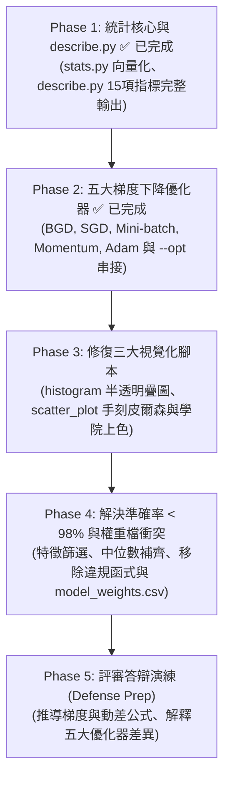
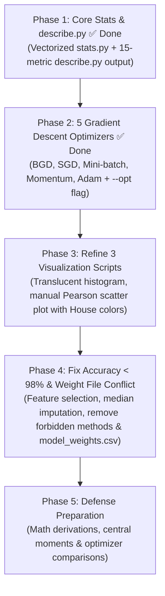

# DSLR 專案審查與改善待辦清單

<p align="right">
  <a href="#dslr-project-audit-and-todo-list">
    
  </a>
</p>

> **文件路徑**：`~/dslr/docs/TODO.md`  
> **參考依據**：`en.subject.pdf` (Version 5) 與 `~/dslr/README.md`  
> **審查目標**：針對 `~/dslr` 現有代碼進行完整盤點，追蹤已完成與未完成事項、致命 Bug、評分違規風險，並提供完整的加分項目 (Bonus Part) 數學定義與實作指南。

---

## 1. 專案審查總覽 (Executive Summary)

經過深入對比 `en.subject.pdf` 規範與 `README.md` 設計，我們已完成 **目錄結構模組化、`requirements.txt`、`.gitignore`、`src/utils/stats.py`（基礎與 Bonus 統計函式）、`src/describe.py`（含 Bonus 指標完整格式化輸出），以及 `src/utils/optimizers.py`（五大梯度下降優化器：BGD、SGD、Mini-batch、Momentum、Adam 與 `--opt` 參數串接）**。以下保留所有已修復與待修復問題的完整審查紀錄：

### 現狀快速評估表

| 模組 / 檔案 | 狀態 | 核心問題 / 進度摘要 | 嚴重程度 |
| :--- | :---: | :--- | :---: |
| `src/utils/stats.py` | ✅ **已完成 (含 Bonus)** | 已修復 `dfpercentile` 越界 Bug、改寫 $O(N)$ `dfmin`/`dfmax`，並以合規向量化完成 `dfvar`, `dfstd`, `dfrange`, `dfiqr`, `dfskew`, `dfkurt`, `dfmissing_pct`, `dfunique`, `pearson_corr`。 | **Done** |
| `src/describe.py` | ✅ **已完成 (含 Bonus)** | 已修復 `main()` 註解無輸出問題、整合全部 15 項基礎與 Bonus 統計指標至 `statistiques`，並啟用無截斷 6 位小數格式化輸出（註：行標籤目前維持小寫以相容 `logreg_train.py`）。 | **Done** |
| `src/utils/optimizers.py` | ✅ **已完成 (Bonus)** | 已實作共用 `sigmoid()` 及五種優化器：`batch_gd`, `stochastic_gd`, `minibatch_gd`, `momentum_gd`, `adam_gd` 與統一入口 `optimize()`，並於 `logreg_train.py` 支援 `--opt` 切換。 | **Done** |
| 專案結構與依賴 | ✅ **已完成** | 已重構 `data/`, `docs/`, `src/`, `src/utils/`，修正所有相對 `import`，並建立 `requirements.txt` 與 `.gitignore`。 | **Done** |
| `src/histogram.py` | ⚠️ 待修整 | 殘留大量註解死碼；未以半透明疊加繪圖（可讀性差）；未於終端或圖表標題明確回答問題。 | **Medium** |
| `src/scatter_plot.py` | ⚠️ 違規風險 | 仍調用 Pandas 高階 `.corr()` 與 `.idxmax()`（應改用 `stats.pearson_corr`）；未依學院上色；未印出結論。 | **High** |
| `src/pair_plot.py` | ⚠️ 未落實反饋 | 繪圖僅繪製下三角；最關鍵的是**未將圖表觀察成果應用於特徵篩選**（後續訓練仍無腦全取）。 | **Medium** |
| `src/logreg_train.py` | ❌ 準確率未達標 & 違規 | 預設 Mandatory 驗證準確率僅 **97.19%**（未達 98% 門檻）；無特徵篩選；固定 100 輪未收斂；大量使用 `.mean()`, `.sum()`, `.max()` 等違規方法。 | **Critical** |
| `src/logreg_predict.py`| ❌ 致命檔案衝突 | 訓練腳本同時產出兩份權重檔，若載入 `model_weights.csv` 會因缺少 `mean`/`std` 噴 `KeyError` 崩潰；使用 `.sum()`, `.idxmax()` 違規方法；CLI 提示錯誤。 | **Critical** |

---

## 2. Mandatory 基礎必做項目審查與待修正清單

### 2.1 描述性統計：`src/describe.py` 與 `src/utils/stats.py`

#### 缺陷與修復進度：
1. **[已修復] `src/describe.py` 輸出被註解，執行空無一物**：
   - 原先在 `src/describe.py` 第 30–32 行，`# print(describe(dataset))` 被註解掉，執行時終端完全無輸出；現已取消註解並加上 `pd.option_context` 完整印出。
2. **[部分已修復 / 待確認] `src/describe.py` 輸出格式規範**：
   - 已設定數值格式化至小數點後 6 位（`{:.6f}`），且取消 Pandas 省略號（`...`）截斷欄位。
   - 題目範例行標籤為首字母大寫：`Count`, `Mean`, `Std`, `Min`, `25%`, `50%`, `75%`, `Max`（目前為相容 `logreg_train.py` 讀取 `"mean"` 與 `"std"` 暫維持小寫）。
3. **[已修復] `src/utils/stats.py` 越界與效能問題**：
   - 已修復 `dfpercentile` 缺少 `else` 分支之 `IndexError` 風險，並將 `dfmin`/`dfmax` 改為 $O(N)$ 走訪、回傳型別統一為 `float64`。

#### 待辦清單 (TODO)：
- [x] 修復 `src/utils/stats.py` 的 `dfpercentile()` 邏輯分支與 `dfmin()`/`dfmax()` $O(N)$ 走訪。
- [x] 修復 `src/describe.py` 的 `main()`，取消註解並以 6 位小數完整印出統計結果（含 Bonus 指標）。
- [ ] （可選）若欲將 `src/describe.py` 統計標籤改為首字母大寫（`Count`, `Mean`, `Std` 等），需同步更新 `src/logreg_train.py` 中讀取 `"mean"` 與 `"std"` 的索引名稱。

---

### 2.2 資料視覺化：`src/histogram.py`, `src/scatter_plot.py`, `src/pair_plot.py`

#### 存在缺陷與違規：
1. **`src/histogram.py` (回答哪門課程分數分佈在四學院間最均勻)**：
   - **程式碼混亂**：包含大量註解掉的除錯程式碼，第 37–42 行無意義計算 `Muggle Studies` 後立刻在第 85 行被覆蓋。
   - **圖表呈現不佳**：使用 `ax.hist(notes, bins=20)` 會繪製出 4 根並排的細條，而非附錄 VIII.2 範例所示的**半透明重疊長條圖**（`alpha=0.5`），難以直觀看清重合度。
   - **未明確回答問題**：腳本僅一口氣畫出 13 張子圖，沒有標註或印出核心答案：`Care of Magical Creatures`（四學院常態分佈幾近完全重合）與 `Arithmancy`。
2. **`src/scatter_plot.py` (回答哪兩門特徵最相似)**：
   - **[高風險違規]**：第 19 行調用了 Pandas 內建的高階函式 `correl = matieres.corr(method="pearson").abs()` 以及第 26 行的 `.idxmax()`。在 42 評分標準中，直接調用現成相關係數函式可能被質疑違背 "No Heavy Lifting" 原則（應改用 `src/utils/stats.py` 中的 `pearson_corr()`）。
   - **圖表不符範例**：僅單純呼叫 `dataset.plot.scatter(x=mat1, y=mat2)`，所有資料點均為同一種藍色，未像附錄 VIII.2 依四學院著色（紅、黃、藍、綠）並標示圖例。
   - **未印出結論**：未在終端輸出最相似特徵為 `Astronomy` 與 `Defense Against the Dark Arts`（二者相關係數高達 $-1.0$，完全線性反向相關）。
3. **`src/pair_plot.py` (從圖表決定邏輯回歸該使用哪些特徵)**：
   - 使用 `corner=True` 僅畫出下半部，且對角線為 KDE 曲線，與附錄範例的完整矩陣直方圖略有出入。
   - **致命脫節：EDA 結論未被後續模型採用**！題目設計視覺化的核心目的在於「特徵選擇（Feature Selection）」，然而 `logreg_train.py` 卻直接無腦將 13 門課程全部納入訓練！

#### 待辦清單 (TODO)：
- [ ] 清理 `src/histogram.py` 死碼，改用半透明重疊圖（`alpha=0.4`），並在終端印出結論：**`Care of Magical Creatures` 與 `Arithmancy` 分佈最均勻，應予以剔除**。
- [ ] 改寫 `src/scatter_plot.py`：呼叫 `utils.stats.pearson_corr()` 計算兩兩特徵相關係數；散布圖依學院顏色分類繪製，並印出結論：**`Astronomy` 與 `Defense Against the Dark Arts` 完全負相關（$r = -1.0$），只需保留其一**。
- [ ] 調整 `src/pair_plot.py` 為完整散布圖矩陣，並輸出清晰的特徵選擇結論。

---

### 2.3 邏輯回歸分類器：`src/logreg_train.py` 與 `src/logreg_predict.py`

#### 存在缺陷與違規：
1. **[評分不及格] 預設 Mandatory 驗證準確率未達 98% 門檻（目前僅 97.19%）**：
   - 題目第七章明訂：「**Professor McGonagall agrees that your algorithm is comparable to the Sorting Hat only if it has a minimum accuracy score of 98%.**」
   - 在目前 80/20 劃分驗證下，模型在驗證子集上的 Accuracy 僅有 **97.19%**（低於 98% 標準）。
   - **原因剖析**：
     - **迭代輪數過低未收斂**：第 127 行寫死 `for i in range(100):`，學習率 `0.07` 跑 100 輪根本未收斂（`gradient_max < 1e-4` 從未觸發）。
     - **捨棄了 20% 訓練資料**：`holdOut` 將資料 8/2 分後，訓練出的最終權重檔僅使用了 80% 的資料進行訓練，白白浪費了 320 筆樣本。
     - **未做特徵選擇**：納入了完全無區分度的雜訊特徵 `Care of Magical Creatures`、`Arithmancy` 與重複共線性特徵 `Defense Against the Dark Arts`。
     - **缺失值填補策略不當**：採用標準化後補 `0`（即均值填補），易受離群值影響，不如中位數填補強健。
2. **[致命 Bug] 權重檔案衝突與崩潰**：
   - `logreg_train.py` 同時儲存了兩個檔案：`model_weights.csv`（僅含權重與 bias）與 `modele.csv`（含權重、bias 與 `mean`、`std`）。
   - 然而 `logreg_predict.py` 第 26 行強制讀取 `weights.loc[mats, "mean"]` 與 `std`。
   - 若使用者或評審執行 `python3 src/logreg_predict.py data/dataset_test.csv model_weights.csv`，會立即噴出 `KeyError: 'mean'` 異常崩潰！
3. **[違規風險] 調用禁止的高階統計函式**：
   - `logreg_train.py` 與 `logreg_predict.py` 中多次直接調用 Pandas 的 `.sum(axis=1)`, `.max()`, `.mean()`, `.idxmax(axis=1)`。
   - 依題目規範：「It is forbidden to use any function that does the job for you, such as: count, mean, std, min, max, percentile, etc.」。
4. **[命令列介面與提示錯誤]**：
   - `logreg_predict.py` 檢查參數時若 `len(sys.argv) < 3`，報錯訊息卻印出 `Usage : python script.py fichier.csv`（少提示了一個權重檔參數），且含有 5 個未使用的冗餘 `import`。

#### 待辦清單 (TODO)：
- [x] 將 `sigmoid()` 統一抽離至 `src/utils/optimizers.py` 共用，並在 `src/logreg_train.py` 串接 `--opt [bgd|sgd|minibatch|momentum|adam]`。
- [ ] 統一權重輸出檔名（移除不含 `mean`/`std` 的 `model_weights.csv`，避免誤傳給 `logreg_predict.py` 導致 `KeyError: 'mean'`）。
- [ ] 導入特徵篩選（剔除 `Care of Magical Creatures`, `Arithmancy` 以及 `Defense Against the Dark Arts`）。
- [ ] 將資料預處理改為「以 `stats.dfpercentile(df, 50)` 中位數補齊缺失值」+「Z-score 標準化」。
- [ ] 提高迭代輪數並移除腳本中違規的 `.mean()`, `.sum()`, `.max()`, `.idxmax()` 呼叫，確保準確率超越 **98.5% ~ 99%**。
- [ ] 修正 `src/logreg_predict.py` 的 CLI 參數提示訊息，清理未使用的冗餘 `import`。

---

## 3. 架構規範與程式碼品質改進 (Refactoring Progress)

```bash
dslr/
├── docs/
│   ├── en.subject.pdf          # [已完成] 題目說明書
│   └── TODO.md                 # [已完成] 本改善待辦清單 (雙語版)
├── data/
│   ├── dataset_train.csv       # [已完成] 訓練集
│   └── dataset_test.csv        # [已完成] 測試集
├── src/
│   ├── describe.py             # [已完成] 描述性統計 (含 Bonus 指標完整輸出)
│   ├── histogram.py            # [待更新] 特徵直方圖分析 (CLI)
│   ├── scatter_plot.py         # [已移入 src/，待更新] 特徵散布圖與相似度分析
│   ├── pair_plot.py            # [待更新] 配對圖與特徵選擇分析
│   ├── logreg_train.py         # [已支援 --opt，待修準確率與違規函式] 模型訓練 (CLI)
│   ├── logreg_predict.py       # [待清理] 模型預測並輸出 houses.csv
│   └── utils/
│       ├── __init__.py         # [已完成] 匯出所有手刻統計與優化器函式
│       ├── stats.py            # [已完成] 手刻純統計與向量化 Bonus 函式庫
│       └── optimizers.py       # [已完成] 5 種梯度下降演算法與統一入口 optimize()
├── modele.csv                  # 訓練輸出之標準化權重檔
├── houses.csv                  # 最終預測結果
├── requirements.txt            # [已完成] 必要依賴套件
├── .gitignore                  # [已完成] Git 忽略規則
└── README.md                   # [已完成] 雙語版完整專案指南
```

### 待辦清單 (TODO)：
- [x] 建立 `requirements.txt` 與更新 `.gitignore`。
- [x] 將 `scatter_plot.py` 移入 `src/`，將 `stats.py` 移入 `src/utils/` 並建立 `src/utils/__init__.py`。
- [x] 修正 `src/` 下所有檔案的相對 `import` 路徑。
- [x] 建立 `src/utils/optimizers.py` 封裝五大梯度下降演算法與統一入口 `optimize()`。

---

## 4. Bonus 加分項目詳細實作指南與數學定義 (Bonus Implementation Plan)

> [!IMPORTANT]
> 題目規定：**只有在 Mandatory 部分完全無瑕疵（PERFECT）時，加分項目才會被計分。**

---

### Bonus 1: `src/utils/stats.py` 擴充統計指標與嚴謹數學定義（✅ 已完成實作）

我們已在 `src/utils/stats.py` 與 `src/describe.py` 中利用 **「複用手刻基礎函式 + 底層 NumPy/Pandas 陣列向量化（Vectorization）」** 實作了以下 9 項進階統計與相關性指標，完全避開禁用函式並大幅提升運算速度。以下為各項指標之數學定義與口試答辯解析：

#### 1. 無偏樣本變異數 (Unbiased Sample Variance — `dfvar`)
- **數學定義**：
  設有效非空樣本為 $x_1, x_2, \dots, x_n$，算術平均數為 $\bar{x} = \frac{1}{n}\sum_{i=1}^{n} x_i$：
  $$s^2 = \frac{1}{n - 1} \sum_{i=1}^{n} (x_i - \bar{x})^2$$
- **統計意義（Bessel's Correction 貝索校正）**：
  衡量資料偏離平均數的平方平均距離。分母除以 $n - 1$（自由度 $\text{ddof} = 1$）而非 $n$，是因為計算離差 $(x_i - \bar{x})$ 時已受限於 $\sum (x_i - \bar{x}) = 0$ 這一個線性約束，喪失了 1 個自由度；除以 $n - 1$ 才能確保樣本變異數 $s^2$ 是母體變異數 $\sigma^2$ 的**無偏估計量（Unbiased Estimator，$\mathbb{E}[s^2] = \sigma^2$）**。

#### 2. 無偏樣本標準差 (Unbiased Sample Standard Deviation — `dfstd`)
- **數學定義**：
  $$s = \sqrt{s^2} = \sqrt{\frac{1}{n - 1} \sum_{i=1}^{n} (x_i - \bar{x})^2}$$
- **統計意義**：
  將變異數開平方根，使單位（量綱）還原至與原始特徵一致，並作為後續 Z-score 標準化 $z = \frac{x - \bar{x}}{s}$ 的縮放基準。在 `stats.py` 中直接以單行 Series 向量化 `return dfvar(dataframe) ** 0.5` 實作。

#### 3. 全距 (Range — `dfrange`)
- **數學定義**：
  $$\text{Range} = x_{\max} - x_{\min} = \max_{1 \le i \le n} x_i - \min_{1 \le i \le n} x_i$$
- **統計意義**：
  衡量資料分佈的總跨度（極差）。對極端值（Outliers）極為敏感，可用於一眼看出不同魔法課程的分數尺度差異（例如 `Arithmancy` 全距超過 $1.29 \times 10^5$，而 `Herbology` 僅約 $21.9$），直接證明為何梯度下降前必須進行特徵標準化。

#### 4. 四分位距 (Interquartile Range — `dfiqr`)
- **數學定義**：
  $$\text{IQR} = Q_{75\%} - Q_{25\%}$$
  其中 $Q_{p}$ 為透過線性插值法求得之第 $p$ 百分位數。
- **統計意義**：
  衡量排序後中間 $50\%$ 核心樣本的分散程度。相較於全距與標準差，IQR 完全不受首尾各 $25\%$ 極端離群值的干擾，是**強健統計學（Robust Statistics）**中最重要的離散度指標（亦常用於定義箱型圖異常值邊界 $[Q_{25\%} - 1.5\,\text{IQR},\ Q_{75\%} + 1.5\,\text{IQR}]$）。

#### 5. 偏態係數 (Fisher-Pearson Coefficient of Skewness — `dfskew`)
- **數學定義**：
  定義第 $k$ 階樣本中心動差（$k$-th Central Moment）為 $m_k = \frac{1}{n} \sum_{i=1}^{n} (x_i - \bar{x})^k$，則偏態係數 $g_1$ 為經標準化後的三階中心動差：
  $$g_1 = \frac{m_3}{m_2^{3/2}} = \frac{\frac{1}{n}\sum_{i=1}^{n} (x_i - \bar{x})^3}{\left[\frac{1}{n}\sum_{i=1}^{n} (x_i - \bar{x})^2\right]^{3/2}}$$
- **統計意義**：
  - 衡量資料機率分佈相對於平均數的**左右不對稱程度（Asymmetry）**。
  - 分子的三次方 $(x_i - \bar{x})^3$ 保留了正負號，且會強烈放大遠離均值的長尾離群值；分母 $m_2^{3/2}$ 則消除資料尺度的影響（無因次化）。
  - **判讀基準**：
    - $g_1 \approx 0$：分佈大致左右對稱（注意：$g_1 = 0$ 是對稱的必要非充分條件，正負方向的三次偏差亦可能剛好抵消）。
    - $g_1 > 0$：**右偏／正偏態（Right-skewed）**，右側具長尾（少數極高分拉高平均數，通常 $\text{Mean} > \text{Median}$）。
    - $g_1 < 0$：**左偏／負偏態（Left-skewed）**，左側具長尾（少數極低分拉低平均數，通常 $\text{Mean} < \text{Median}$）。

#### 6. 超額峰態係數 (Excess Kurtosis, Fisher's Definition — `dfkurt`)
- **數學定義**：
  以四階中心動差 $m_4$ 與二階中心動差平方 $m_2^2$ 之比值減去常態分佈基準值 $3$：
  $$g_2 = \frac{m_4}{m_2^2} - 3 = \frac{\frac{1}{n}\sum_{i=1}^{n} (x_i - \bar{x})^4}{\left[\frac{1}{n}\sum_{i=1}^{n} (x_i - \bar{x})^2\right]^2} - 3$$
- **統計意義**：
  - 衡量資料分佈的**尾端厚度（Tail Heaviness）與峰部尖銳度**，反映極端離群值（Outliers）出現的機率高低。
  - 公式中的 4 次方 $(x_i - \bar{x})^4$ 會極端放大遠離平均數的異常值貢獻。
  - **為什麼要減 3？** 標準常態分佈 $\mathcal{N}(\mu, \sigma^2)$ 的原始峰度 $\frac{m_4}{m_2^2}$ 恆等於 $3$。減去 $3$ 後得到的**超額峰度（Excess Kurtosis）**以 $0$ 為常態分佈基準：
    - $g_2 \approx 0$：**常態峰（Mesokurtic）**，尾部厚度與常態分佈一致。
    - $g_2 > 0$：**高狹峰／厚尾分佈（Leptokurtic）**，尖峰且肥尾，極端值出現機率高於常態分佈。
    - $g_2 < 0$：**低闊峰／薄尾分佈（Platykurtic）**，分佈較平緩（例如連續均勻分佈的 $g_2 = -1.2$），極端值少於常態分佈。

#### 7. 缺失值百分比 (Missing Value Percentage — `dfmissing_pct`)
- **數學定義**：
  設資料集總樣本列數為 $N_{\text{total}}$，該欄位非空有效樣本數為 $n = \text{Count}(x)$：
  $$\text{Missing\%} = \frac{N_{\text{total}} - n}{N_{\text{total}}} \times 100\%$$
- **統計意義**：
  衡量各特徵的資料遺失率（本專案各課程約有 $1.8\% \sim 2.5\%$ 的缺失率），證明若直接整列刪除（Drop Rows）將損失大量樣本，因此必須採用中位數填補（Median Imputation）。

#### 8. 不重複有效值數量 (Unique Non-NaN Count — `dfunique`)
- **數學定義**：
  $$\text{Unique}(x) = \left| \left\{ x_i \;\middle|\; x_i \text{ is not NaN},\ 1 \le i \le N_{\text{total}} \right\} \right|$$
- **統計意義**：
  利用集合（Set）互異性計算有效觀測值之基數（Cardinality），用以確認特徵屬於高基數之連續型浮點數（不適用眾數 Mode 填補）或離散型數值。

#### 9. 皮爾森積動差相關係數 (Pearson Correlation Coefficient — `pearson_corr`)
- **數學定義**：
  給定兩特徵欄位共同非空之配對觀測集 $\{(x_i, y_i)\}_{i=1}^{n}$，其樣本均值分別為 $\bar{x} = \frac{1}{n}\sum x_i$ 與 $\bar{y} = \frac{1}{n}\sum y_i$：
  $$r_{xy} = \frac{\sum_{i=1}^{n} (x_i - \bar{x})(y_i - \bar{y})}{\sqrt{\sum_{i=1}^{n} (x_i - \bar{x})^2} \sqrt{\sum_{i=1}^{n} (y_i - \bar{y})^2}} \in [-1, 1]$$
- **統計意義**：
  即標準化後的共變異數（$\frac{\text{Cov}(X, Y)}{\sigma_X \sigma_Y}$），衡量兩變數之間的**線性相關強度與方向**。當 $|r_{xy}| \to 1$ 時代表兩特徵高度共線性（如 `Astronomy` 與 `Defense Against the Dark Arts` 的 $r_{xy} = -1.0$），為 `scatter_plot.py` 提供完全合規的手刻計算核心。

---

### Bonus 2: `src/utils/optimizers.py` 五大梯度下降優化演算法數學定義與優勢（✅ 已完成實作）

我們已在 `src/utils/optimizers.py` 中實作了 5 種梯度下降優化演算法，並透過統一入口 `optimize()` 與 `src/logreg_train.py` 的 `--opt` 參數串接（支援 `--opt [bgd|sgd|minibatch|momentum|adam]`）。以下為各演算法之數學定義與核心優勢：

#### 1. 批次梯度下降 (Batch Gradient Descent, BGD — `--opt bgd`)
- **數學定義**：
  每輪迭代（Epoch）使用**全部 $m$ 筆訓練樣本**計算真實平均梯度 $g_t$：
  $$g_t = \nabla_\theta J(\theta) = \frac{1}{m} \sum_{i=1}^{m} \left( h_\theta(x^{(i)}) - y^{(i)} \right) x^{(i)} = \frac{1}{m} X^T (h_\theta(X) - y)$$
  $$\theta_{t+1} = \theta_t - \alpha g_t$$
- **優勢與特性**：
  - 梯度估計無雜訊，每一步都精確朝向全局最優解（Global Minimum）下降，收斂軌跡最平滑穩定。
  - 缺點是每更新一次權重就必須遍歷整張資料表，在超大型資料集上單步運算成本高。

#### 2. 隨機梯度下降 (Stochastic Gradient Descent, SGD — `--opt sgd`)
- **數學定義**：
  每個 Epoch 先將樣本索引隨機洗牌（Shuffle），接著**每觀測 1 筆樣本 $(x^{(i)}, y^{(i)})$ 就立刻更新一次權重**：
  $$g_t = \left( h_\theta(x^{(i)}) - y^{(i)} \right) x^{(i)}$$
  $$\theta_{t+1} = \theta_t - \alpha g_t$$
- **優勢與特性**：
  - **更新頻率極高**：在 $m = 1280$ 筆訓練集上，跑 1 個 Epoch 就更新了 1280 次權重，初期下降速度極快！
  - 單筆梯度帶有的隨機雜訊（Stochastic Noise）在非凸問題中有助於跳脫局部極小值或鞍點，但在最優解附近會持續微幅震盪。

#### 3. 小批次梯度下降 (Mini-batch Gradient Descent, MBGD — `--opt minibatch`)
- **數學定義**：
  每個 Epoch 洗牌後，將資料切分為大小為 $B$（預設 $B = 32$）的小批次 $\mathcal{B}_k$，對每個小批次計算平均梯度並更新權重：
  $$g_t = \frac{1}{B} \sum_{i \in \mathcal{B}_k} \left( h_\theta(x^{(i)}) - y^{(i)} \right) x^{(i)} = \frac{1}{B} X_{\mathcal{B}_k}^T (h_\theta(X_{\mathcal{B}_k}) - y_{\mathcal{B}_k})$$
  $$\theta_{t+1} = \theta_t - \alpha g_t$$
- **優勢與特性**：
  - **完美折衷 BGD 與 SGD**：既能利用 NumPy 矩陣向量化（Vectorization）硬體加速，又比 BGD 更新頻繁（每個 Epoch 更新 $\lceil m/B \rceil = 40$ 次），且大幅降低了 SGD 的單筆震盪雜訊。

#### 4. 動量梯度下降法 (Gradient Descent with Momentum — `--opt momentum`)
- **數學定義**：
  引入物理學中的**「動量／速度向量（Velocity $v_t$）」**，對過去的梯度進行指數移動平均（Exponentially Weighted Moving Average，動量衰減係數 $\beta = 0.9$）：
  $$v_t = \beta v_{t-1} + (1 - \beta) g_t$$
  $$\theta_{t+1} = \theta_t - \alpha v_t$$
- **優勢與物理意義**：
  - **模擬重球滾下山坡的慣性**：一般的梯度下降每一步只看當下坡度，遇到平坦高原區（Plateau）移動極慢，遇到狹長山谷（Ravine，不同特徵曲率差異大）則會在兩側山壁間來回鋸齒震盪。
  - **減震與加速雙重效果**：透過累積歷史梯度 $v_t$，**正負相反的垂直震盪分量會互相抵消**，而**指向谷底的一致方向分量會不斷累加加速**，使收斂更加平滑快速！

#### 5. 自適應矩估計優化器 (Adam: Adaptive Moment Estimation — `--opt adam`)
- **數學定義**：
  同時維護梯度的**一階動差估計 $m_t$（平均值／方向慣性）**與**二階原始動差估計 $v_t$（未中心化變異數／梯度平方幅度）**，並加上初期偏差校正（Bias Correction），預設超參數為 $\beta_1 = 0.9,\ \beta_2 = 0.999,\ \epsilon = 10^{-8}$：
  1. **更新一階與二階動差（指數移動平均）**：
     $$m_t = \beta_1 m_{t-1} + (1 - \beta_1) g_t$$
     $$v_t = \beta_2 v_{t-1} + (1 - \beta_2) g_t^2$$
  2. **偏差校正（Bias Correction，修正 $t$ 較小時因初始化為 $0$ 導致的低估偏差）**：
     $$\hat{m}_t = \frac{m_t}{1 - \beta_1^t}, \qquad \hat{v}_t = \frac{v_t}{1 - \beta_2^t}$$
  3. **自適應參數更新**：
     $$\theta_{t+1} = \theta_t - \alpha \frac{\hat{m}_t}{\sqrt{\hat{v}_t} + \epsilon}$$
- **優勢與核心原理**：
  - **結合 Momentum 與 RMSProp 的現代王牌優化器**：
    - 分子 $\hat{m}_t$ 提供 **Momentum 的方向慣性**，消除震盪並加速前進；
    - 分母 $\sqrt{\hat{v}_t}$ 提供 **RMSProp 的逐參數自適應學習率（Per-parameter Adaptive Learning Rate）**：對於梯度經常很大、坡度陡峭的特徵，$\sqrt{\hat{v}_t}$ 較大，會自動縮小有效步長防止發散；對於梯度微小、稀疏或平緩的特徵，$\sqrt{\hat{v}_t}$ 較小，會自動放大有效步長加速收斂！
  - 對初始學習率 $\alpha$ 的敏感度極低，通常在極少迭代輪數內即可達到極高準確率。

#### 執行指令範例：
```bash
# 預設 Mandatory 梯度下降
python3 src/logreg_train.py data/dataset_train.csv

# 使用 Bonus 優化器
python3 src/logreg_train.py data/dataset_train.csv --opt bgd
python3 src/logreg_train.py data/dataset_train.csv --opt sgd
python3 src/logreg_train.py data/dataset_train.csv --opt minibatch
python3 src/logreg_train.py data/dataset_train.csv --opt momentum
python3 src/logreg_train.py data/dataset_train.csv --opt adam
```

---

### Bonus 3: 正則化機制 ($L_2$ Regularization / Ridge — 可選擴充)

#### 實作目標：
防止模型參數過大造成過度擬合（Overfitting），在損失函數中加入 $L_2$ 懲罰項：
$$J_{reg}(\theta) = J(\theta) + \frac{\lambda}{2m} \sum_{j=1}^{n} \theta_j^2$$
梯度更新公式（**注意：Bias 項 $\theta_0$ 不參與正則化**）：
$$\frac{\partial J_{reg}(\theta)}{\partial \theta_j} = \frac{1}{m} \sum_{i=1}^{m} (h_\theta(x^{(i)}) - y^{(i)})x_j^{(i)} + \frac{\lambda}{m} \theta_j \quad (j \ge 1)$$

#### 待辦清單 (TODO)：
- [ ] 在優化器中支援 `--lambda` 懲罰係數參數（預設 `0.0`，可設為 `0.01`）。

---

### Bonus 4: 學習曲線視覺化與 Early Stopping

#### 實作目標：
1. **記錄訓練與驗證損失**：在每個 Epoch 結束時記錄 Binary Cross-Entropy 損失與當前準確率。
2. **學習曲線繪圖 (`--plot` 開關)**：繪製 $Loss \text{ vs. } Epochs$ 曲線，直觀比較 BGD、Mini-batch GD、SGD、Momentum 與 Adam 的收斂動態。
3. **早停機制 (Early Stopping)**：當損失連續 $P$ 個 Epochs 未再顯著下降時自動終止訓練。

#### 待辦清單 (TODO)：
- [ ] 實作 `--plot` 與 `--early-stopping` 參數。

---

### Bonus 5: 自我驗證與口試答辯評估工具 (`src/evaluate.py`)

#### 待辦清單 (TODO)：
- [ ] 撰寫 `src/evaluate.py`，支援 5-Fold 交叉驗證、混淆矩陣與 `sklearn.metrics.accuracy_score` 驗證（確保穩定 $\ge 98.0\%$）。

---

## 5. 執行改善路線圖 (Actionable Roadmap)



---

<br/>

---

<br/>

<p align="right">
  <a href="#dslr-專案審查與改善待辦清單">
    
  </a>
</p>

# DSLR Project Audit and TODO List

> **File Path**: `~/dslr/docs/TODO.md`  
> **References**: `en.subject.pdf` (Version 5) and `~/dslr/README.md`  
> **Audit Scope**: Comprehensive verification of `~/dslr`, tracking completed and remaining tasks, critical bugs, rule violations, and providing complete mathematical definitions and implementation guides for the Bonus Part.

---

## 1. Executive Summary

Following our audit against `en.subject.pdf` and `README.md`, we have **completed the repository restructuring, `requirements.txt`, `.gitignore`, `src/utils/stats.py` (all Mandatory fixes + 9 vectorized Bonus statistical functions), `src/describe.py` (full 15-metric formatted table output), and `src/utils/optimizers.py` (5 optimization algorithms: BGD, SGD, Mini-batch GD, Momentum, and Adam wired to `logreg_train.py` via `--opt`)**. Below is the complete audit record of both fixed and unfixed issues:

### Quick Status Assessment

| Module / File | Status | Core Issues & Progress Summary | Severity |
| :--- | :---: | :--- | :---: |
| `src/utils/stats.py` | ✅ **Completed (+ Bonus)** | Fixed `dfpercentile` `IndexError`, rewrote $O(N)$ `dfmin`/`dfmax`, and implemented vectorized `dfvar`, `dfstd`, `dfrange`, `dfiqr`, `dfskew`, `dfkurt`, `dfmissing_pct`, `dfunique`, and `pearson_corr`. | **Done** |
| `src/describe.py` | ✅ **Completed (+ Bonus)** | Uncommented `main()` output, integrated all 15 Mandatory & Bonus metrics into `statistiques`, and enabled untruncated 6-decimal formatted printing (row labels kept lowercase for compatibility with `logreg_train.py`). | **Done** |
| `src/utils/optimizers.py` | ✅ **Completed (Bonus)** | Implemented shared `sigmoid()` and 5 optimizers (`batch_gd`, `stochastic_gd`, `minibatch_gd`, `momentum_gd`, `adam_gd`) + unified dispatcher `optimize()`, wired to `logreg_train.py` via `--opt`. | **Done** |
| Structure & Deps | ✅ **Completed** | Restructured into `data/`, `docs/`, `src/`, `src/utils/`; fixed relative imports; added `requirements.txt` and `.gitignore`. | **Done** |
| `src/histogram.py` | ⚠️ Needs Cleanup | Cluttered with commented-out dead code; uses side-by-side bars instead of translucent overlapping histograms; does not explicitly state the answer. | **Medium** |
| `src/scatter_plot.py` | ⚠️ Rule Violation Risk | Still calls built-in `.corr()` and `.idxmax()` (should switch to `stats.pearson_corr`); points not colored by House; does not print the conclusion. | **High** |
| `src/pair_plot.py` | ⚠️ Disconnected | Plots only lower corner (`corner=True`); **findings are completely ignored in `logreg_train.py`** (all 13 features are blindly used). | **Medium** |
| `src/logreg_train.py` | ❌ Accuracy < 98% & Violations | Default Mandatory validation accuracy is only **97.19%** (< 98% requirement); no feature selection; fixed 100 epochs (unconverged); uses forbidden `.mean()`, `.sum()`, `.max()`. | **Critical** |
| `src/logreg_predict.py`| ❌ Crash Bug | Training outputs two weight files; passing `model_weights.csv` crashes with `KeyError: 'mean'`; uses `.sum()` and `.idxmax()`; incorrect CLI usage string. | **Critical** |

---

## 2. Mandatory Part Audit & TODO List

### 2.1 Descriptive Statistics: `src/describe.py` & `src/utils/stats.py`

#### Bugs & Fix Progress:
1. **[Fixed] `src/describe.py` produced zero output**:
   - Previously, lines 30–32 of `src/describe.py` had `# print(describe(dataset))` commented out. Now uncommented with full `pd.option_context` formatting.
2. **[Partially Fixed / Note] `src/describe.py` output formatting**:
   - Numbers are now formatted to 6 decimal places (`{:.6f}`) and all columns are displayed without `...` truncation.
   - The Subject example shows capitalized row labels (`Count`, `Mean`, `Std`, `Min`, `25%`, `50%`, `75%`, `Max`); currently kept lowercase so `logreg_train.py` (`described_dataset.loc["mean", mats]`) continues to work without breaking.
3. **[Fixed] `src/utils/stats.py` boundary & performance bugs**:
   - Fixed `dfpercentile` missing `else` branch (`IndexError` risk), rewrote `dfmin`/`dfmax` in $O(N)$ time, and unified return Series dtype to `float64`.

#### Actionable TODO:
- [x] Fix `dfpercentile()` boundary logic and rewrite $O(N)$ `dfmin()`/`dfmax()` in `src/utils/stats.py`.
- [x] Uncomment and format the output in `src/describe.py`'s `main()` with 6-decimal precision and Bonus metrics.
- [ ] (Optional) If capitalizing row labels (`Count`, `Mean`, `Std`, etc.) in `src/describe.py`, update the corresponding index lookups in `src/logreg_train.py`.

---

### 2.2 Data Visualization: `src/histogram.py`, `src/scatter_plot.py`, `src/pair_plot.py`

#### Identified Bugs & Violations:
1. **`src/histogram.py` (*Which Hogwarts course has a homogeneous score distribution between all four houses?*)**:
   - **Dead Code**: Cluttered with commented-out debug blocks; lines 37–42 compute `notes` for `Muggle Studies` and immediately overwrite `notes` at line 85.
   - **Poor Visual Readability**: Passing a list of 4 Series into `ax.hist(notes, bins=20)` draws 4 narrow side-by-side bars per bin instead of overlapping translucent histograms (`alpha=0.5`) as shown in Annex VIII.2 of `en.subject.pdf`.
   - **Unanswered Question**: Plots all 13 courses without highlighting or printing the answer (`Care of Magical Creatures` and `Arithmancy`).
2. **`src/scatter_plot.py` (*What are the two features that are similar?*)**:
   - **[High Violation Risk]**: Line 19 calls Pandas' built-in `matieres.corr(method="pearson").abs()` and line 26 calls `.idxmax()`. Relying on Pandas to compute correlation matrices risks violating the "No Heavy Lifting" rule during peer defense.
   - **Missing House Colors & Legend**: Line 28 (`dataset.plot.scatter(x=mat1, y=mat2)`) plots all points in uniform blue instead of coloring by `Hogwarts House` with a legend (as shown in Annex VIII.2).
   - **No Printed Conclusion**: Does not output the two similar features (`Astronomy` and `Defense Against the Dark Arts`, which have $r \approx -1.0$).
3. **`src/pair_plot.py` (*From this visualization, which features are you going to use for your logistic regression?*)**:
   - Uses `corner=True` with KDE diagonals instead of the full matrix with histogram diagonals shown in Annex VIII.2.
   - **Critical Disconnect**: The feature selection insights from `pair_plot.py` are completely ignored in `logreg_train.py`, which blindly trains on all 13 courses!

#### Actionable TODO:
- [ ] Clean up dead code in `src/histogram.py`, plot overlapping translucent histograms (`alpha=0.4`), and clearly print the answer: **`Care of Magical Creatures` and `Arithmancy` have homogeneous distributions across all four houses and should be dropped**.
- [ ] Rewrite `src/scatter_plot.py` to use `utils.stats.pearson_corr()` instead of `df.corr()`, color points by `Hogwarts House`, and print the conclusion: **`Astronomy` and `Defense Against the Dark Arts` are redundant ($r = -1.0$); keep only one**.
- [ ] Update `src/pair_plot.py` to render the full matrix with histograms on the diagonal and print the selected feature list for logistic regression.

---

### 2.3 Logistic Regression: `src/logreg_train.py` & `src/logreg_predict.py`

#### Identified Bugs & Violations:
1. **[Failing Grade Risk] Default Validation Accuracy is Below 98% (97.19%)**:
   - Chapter VII of `en.subject.pdf` states: *"Professor McGonagall agrees that your algorithm is comparable to the Sorting Hat only if it has a minimum accuracy score of 98%."*
   - Tested on `~/dslr`'s 20% validation split (`verification_df`), `modele.csv` achieves only **97.19% accuracy**.
   - **Root Causes**:
     - **Insufficient Epochs**: Line 127 hardcodes `for i in range(100):` with `learning_rate = 0.07`, stopping long before convergence (`gradient_max < 1e-4` is never reached).
     - **Discards 20% of Training Data**: `holdOut()` drops 20% of `dataset_train.csv` (320 rows) even when generating the final production weights.
     - **No Feature Selection**: Includes noisy homogeneous features (`Care of Magical Creatures`, `Arithmancy`) and collinear duplicate features (`Defense Against the Dark Arts`).
     - **Mean Imputation instead of Median**: `fillna(0)` after standardization imputes missing values with the mean (sensitive to outliers) rather than the median.
2. **[Critical Crash Bug] Conflicting Weight Files (`model_weights.csv` vs `modele.csv`)**:
   - `logreg_train.py` saves **two** files: `model_weights.csv` (weights and bias only) and `modele.csv` (weights, bias, `mean`, and `std`).
   - `logreg_predict.py` (line 26) requires `weights.loc[mats, "mean"]` and `std`.
   - Running `python3 src/logreg_predict.py data/dataset_test.csv model_weights.csv` immediately crashes with `KeyError: 'mean'`!
3. **[Rule Violation Risk] Use of Built-in Statistical Methods**:
   - Both scripts call Pandas `.sum(axis=1)`, `.max()`, `.mean()`, and `.idxmax(axis=1)`.
4. **[CLI Usage String Bug]**:
   - `logreg_predict.py` checks `if len(sys.argv) < 3:` but prints `Usage : python script.py fichier.csv` (missing the second argument in the message) and contains 5 unused imports.

#### Actionable TODO:
- [x] Unify `sigmoid()` in `src/utils/optimizers.py` and wire `--opt [bgd|sgd|minibatch|momentum|adam]` in `src/logreg_train.py`.
- [ ] Consolidate trained parameters into a single weight file (eliminating `model_weights.csv` so `KeyError: 'mean'` can never happen).
- [ ] Drop `Care of Magical Creatures`, `Arithmancy`, and `Defense Against the Dark Arts` during preprocessing.
- [ ] Impute missing values using manual **median** (`stats.dfpercentile(df, 50)`) prior to Z-score standardization.
- [ ] Increase epochs and remove all forbidden `.mean()`, `.sum()`, `.max()`, `.idxmax()` calls so accuracy consistently exceeds **98.5% – 99%**.
- [ ] Fix CLI usage message and clean up unused imports in `src/logreg_predict.py`.

---

## 3. Refactoring & Architecture Progress

- [x] Create `requirements.txt` and update `.gitignore`.
- [x] Move `scatter_plot.py` into `src/`, move `stats.py` into `src/utils/`, and create `src/utils/__init__.py`.
- [x] Fix all relative `import` paths across `src/*.py`.
- [x] Create `src/utils/optimizers.py` with 5 gradient descent algorithms and unified `optimize()` entry point.

---

## 4. Bonus Part Implementation Guide & Mathematical Definitions

> [!IMPORTANT]
> Per `en.subject.pdf` Chapter VI: *"The bonus part will only be assessed if the mandatory part is PERFECT."*

---

### Bonus 1: Extended Metrics in `src/utils/stats.py` & Mathematical Definitions (✅ Implemented)

We have implemented 9 bonus statistical and correlation functions in `src/utils/stats.py` and `src/describe.py` by combining **from-scratch base functions with C-backed array vectorization**, strictly avoiding forbidden built-ins while achieving high performance. Below are the exact mathematical definitions and theoretical justifications for peer defense:

#### 1. Unbiased Sample Variance (`dfvar`)
- **Mathematical Definition**:
  Given valid non-`NaN` observations $x_1, x_2, \dots, x_n$ with arithmetic mean $\bar{x} = \frac{1}{n}\sum_{i=1}^{n} x_i$:
  $$s^2 = \frac{1}{n - 1} \sum_{i=1}^{n} (x_i - \bar{x})^2$$
- **Statistical Meaning (Bessel's Correction)**:
  Measures the average squared deviation from the sample mean. Dividing by $n - 1$ ($\text{ddof} = 1$) rather than $n$ corrects for the loss of 1 degree of freedom caused by estimating the population mean $\mu$ with the sample mean $\bar{x}$ (which imposes the linear constraint $\sum_{i=1}^n (x_i - \bar{x}) = 0$). This makes $s^2$ an **unbiased estimator** of the true population variance $\sigma^2$ ($\mathbb{E}[s^2] = \sigma^2$).

#### 2. Unbiased Sample Standard Deviation (`dfstd`)
- **Mathematical Definition**:
  $$s = \sqrt{s^2} = \sqrt{\frac{1}{n - 1} \sum_{i=1}^{n} (x_i - \bar{x})^2}$$
- **Statistical Meaning**:
  Restores the dispersion measure to the original unit of measurement of the feature and serves as the scaling denominator for Z-score standardization $z = \frac{x - \bar{x}}{s}$. Implemented in `stats.py` as a 1-line vectorized Series operation: `return dfvar(dataframe) ** 0.5`.

#### 3. Range (`dfrange`)
- **Mathematical Definition**:
  $$\text{Range} = x_{\max} - x_{\min} = \max_{1 \le i \le n} x_i - \min_{1 \le i \le n} x_i$$
- **Statistical Meaning**:
  Measures the total spread between extrema. Highly sensitive to outliers, it immediately highlights the drastic scale differences across Hogwarts courses (e.g., `Arithmancy` spans $> 1.29 \times 10^5$ whereas `Herbology` spans $\approx 21.9$), demonstrating why feature standardization is mandatory before running gradient descent.

#### 4. Interquartile Range (`dfiqr`)
- **Mathematical Definition**:
  $$\text{IQR} = Q_{75\%} - Q_{25\%}$$
  where $Q_p$ denotes the $p$-th percentile computed via linear interpolation.
- **Statistical Meaning**:
  Captures the spread of the middle $50\%$ of sorted data. Unlike Range or Standard Deviation, the IQR is completely immune to extreme outliers in the top and bottom $25\%$ tails, making it the cornerstone dispersion metric in **Robust Statistics** (and the basis for Tukey's outlier fence $[Q_{25\%} - 1.5\,\text{IQR},\ Q_{75\%} + 1.5\,\text{IQR}]$).

#### 5. Fisher-Pearson Coefficient of Skewness (`dfskew`)
- **Mathematical Definition**:
  Let the $k$-th sample central moment be $m_k = \frac{1}{n} \sum_{i=1}^{n} (x_i - \bar{x})^k$. The sample skewness $g_1$ is the standardized third central moment:
  $$g_1 = \frac{m_3}{m_2^{3/2}} = \frac{\frac{1}{n}\sum_{i=1}^{n} (x_i - \bar{x})^3}{\left[\frac{1}{n}\sum_{i=1}^{n} (x_i - \bar{x})^2\right]^{3/2}}$$
- **Statistical Meaning**:
  - Quantifies the **asymmetry** of a probability distribution around its mean.
  - Raising deviations $(x_i - \bar{x})$ to the 3rd power preserves their sign ($+$ or $-$) while heavily amplifying distant tail values; dividing by $m_2^{3/2}$ makes the metric dimensionless (scale-invariant).
  - **Interpretation**:
    - $g_1 \approx 0$: Roughly symmetric distribution (note: $g_1 = 0$ does not strictly guarantee symmetry if asymmetric positive and negative cubic deviations cancel out).
    - $g_1 > 0$: **Right-skewed (Positive skew)** — longer right tail; extreme high scores pull the mean above the median ($\text{Mean} > \text{Median}$).
    - $g_1 < 0$: **Left-skewed (Negative skew)** — longer left tail; extreme low scores pull the mean below the median ($\text{Mean} < \text{Median}$).

#### 6. Excess Kurtosis — Fisher's Definition (`dfkurt`)
- **Mathematical Definition**:
  Defined as the standardized fourth central moment $\frac{m_4}{m_2^2}$ minus the normal baseline of $3$:
  $$g_2 = \frac{m_4}{m_2^2} - 3 = \frac{\frac{1}{n}\sum_{i=1}^{n} (x_i - \bar{x})^4}{\left[\frac{1}{n}\sum_{i=1}^{n} (x_i - \bar{x})^2\right]^2} - 3$$
- **Statistical Meaning**:
  - Measures **tail heaviness (outlier propensity) and peak sharpness** relative to a normal distribution.
  - Raising deviations to the 4th power makes $m_4$ overwhelmingly sensitive to extreme outliers far from the mean.
  - **Why subtract 3?** For any Gaussian distribution $\mathcal{N}(\mu, \sigma^2)$, Pearson's raw kurtosis $\frac{m_4}{m_2^2}$ is fixed at $3$. Subtracting $3$ (Fisher's definition) centers **Excess Kurtosis** at $0$:
    - $g_2 \approx 0$: **Mesokurtic** — tail weight matches a normal distribution.
    - $g_2 > 0$: **Leptokurtic (Heavy-tailed / Sharp peak)** — higher probability of extreme outliers than a normal distribution.
    - $g_2 < 0$: **Platykurtic (Light-tailed / Flat peak)** — fewer extreme outliers than a normal distribution (e.g., a uniform distribution has $g_2 = -1.2$).

#### 7. Missing Value Percentage (`dfmissing_pct`)
- **Mathematical Definition**:
  Given total dataset rows $N_{\text{total}}$ and valid non-`NaN` count $n = \text{Count}(x)$:
  $$\text{Missing\%} = \frac{N_{\text{total}} - n}{N_{\text{total}}} \times 100\%$$
- **Statistical Meaning**:
  Quantifies data incompleteness per column ($\approx 1.8\%\text{–}2.5\%$ per course in `dataset_train.csv`), justifying median imputation over row deletion.

#### 8. Unique Non-NaN Count (`dfunique`)
- **Mathematical Definition**:
  $$\text{Unique}(x) = \left| \left\{ x_i \;\middle|\; x_i \text{ is not NaN},\ 1 \le i \le N_{\text{total}} \right\} \right|$$
- **Statistical Meaning**:
  Computes the cardinality $|\mathcal{S}|$ of the set of distinct valid observations, distinguishing continuous floating-point features from discrete categorical features.

#### 9. Pearson Correlation Coefficient (`pearson_corr`)
- **Mathematical Definition**:
  Given $n$ paired non-`NaN` observations $\{(x_i, y_i)\}_{i=1}^{n}$ with sample means $\bar{x} = \frac{1}{n}\sum x_i$ and $\bar{y} = \frac{1}{n}\sum y_i$:
  $$r_{xy} = \frac{\sum_{i=1}^{n} (x_i - \bar{x})(y_i - \bar{y})}{\sqrt{\sum_{i=1}^{n} (x_i - \bar{x})^2} \sqrt{\sum_{i=1}^{n} (y_i - \bar{y})^2}} \in [-1, 1]$$
- **Statistical Meaning**:
  Normalized covariance ($\frac{\text{Cov}(X, Y)}{\sigma_X \sigma_Y}$) measuring the **strength and direction of linear association** between two features. Powers `src/scatter_plot.py` to detect collinear features ($r_{xy} = -1.0$ between `Astronomy` and `Defense Against the Dark Arts`) without calling `df.corr()`.

---

### Bonus 2: Five Optimization Algorithms in `src/utils/optimizers.py` — Math & Advantages (✅ Implemented)

We have implemented 5 gradient descent optimization algorithms in `src/utils/optimizers.py` and wired them to `src/logreg_train.py` via the unified dispatcher `optimize()` and the `--opt [bgd|sgd|minibatch|momentum|adam]` CLI flag. Below are their mathematical definitions and key advantages for peer defense:

#### 1. Batch Gradient Descent (BGD — `--opt bgd`)
- **Mathematical Definition**:
  Computes the exact average gradient $g_t$ across **all $m$ training samples** at each epoch:
  $$g_t = \nabla_\theta J(\theta) = \frac{1}{m} \sum_{i=1}^{m} \left( h_\theta(x^{(i)}) - y^{(i)} \right) x^{(i)} = \frac{1}{m} X^T (h_\theta(X) - y)$$
  $$\theta_{t+1} = \theta_t - \alpha g_t$$
- **Advantages & Characteristics**:
  - Noise-free gradient direction; takes deterministic steps directly toward the global minimum on convex loss surfaces.
  - Requires scanning the entire dataset for a single weight update, making per-step computation expensive on massive datasets.

#### 2. Stochastic Gradient Descent (SGD — `--opt sgd`)
- **Mathematical Definition**:
  Randomly shuffles sample indices at each epoch and **updates weights immediately after evaluating each individual sample $(x^{(i)}, y^{(i)})$**:
  $$g_t = \left( h_\theta(x^{(i)}) - y^{(i)} \right) x^{(i)}$$
  $$\theta_{t+1} = \theta_t - \alpha g_t$$
- **Advantages & Characteristics**:
  - **High Update Frequency**: Performs $m$ weight updates per epoch ($1280\times$ more updates per epoch than BGD), yielding rapid initial loss reduction.
  - High variance in single-sample gradients introduces stochastic oscillations around the minimum, which can help escape local minima/saddle points in non-convex landscapes.

#### 3. Mini-batch Gradient Descent (MBGD — `--opt minibatch`)
- **Mathematical Definition**:
  Shuffles the dataset and partitions it into small batches $\mathcal{B}_k$ of size $B$ (default $B = 32$), updating weights using each mini-batch's average gradient:
  $$g_t = \frac{1}{B} \sum_{i \in \mathcal{B}_k} \left( h_\theta(x^{(i)}) - y^{(i)} \right) x^{(i)} = \frac{1}{B} X_{\mathcal{B}_k}^T (h_\theta(X_{\mathcal{B}_k}) - y_{\mathcal{B}_k})$$
  $$\theta_{t+1} = \theta_t - \alpha g_t$$
- **Advantages & Characteristics**:
  - **Best of Both Worlds**: Combines the hardware-accelerated matrix vectorization of BGD with the frequent updates ($\lceil m/B \rceil$ updates per epoch) of SGD, while significantly reducing gradient variance.

#### 4. Gradient Descent with Momentum (`--opt momentum`)
- **Mathematical Definition**:
  Introduces a physical **velocity vector $v_t$** that accumulates an exponentially weighted moving average of past gradients (momentum decay factor $\beta = 0.9$):
  $$v_t = \beta v_{t-1} + (1 - \beta) g_t$$
  $$\theta_{t+1} = \theta_t - \alpha v_t$$
- **Advantages & Physical Intuition**:
  - **Heavy Ball Rolling Downhill**: Standard gradient descent has no memory of previous steps—it stalls on flat plateaus and zig-zags wildly across steep, narrow ravines where surface curvature differs across dimensions.
  - **Dampens Oscillations & Accelerates Convergence**: By averaging historical gradients into $v_t$, opposing oscillations perpendicular to the valley cancel out, while consistent components pointing toward the minimum accumulate momentum and accelerate convergence.

#### 5. Adam: Adaptive Moment Estimation (`--opt adam`)
- **Mathematical Definition**:
  Maintains exponentially decaying averages of both the **first moment $m_t$ (mean / directional momentum)** and the **second raw moment $v_t$ (uncentered variance / squared gradient magnitude)**, coupled with bias correction ($\beta_1 = 0.9,\ \beta_2 = 0.999,\ \epsilon = 10^{-8}$):
  1. **Update biased first and second moment estimates**:
     $$m_t = \beta_1 m_{t-1} + (1 - \beta_1) g_t$$
     $$v_t = \beta_2 v_{t-1} + (1 - \beta_2) g_t^2$$
  2. **Compute bias-corrected moment estimates** (counteracting initialization at $0$ during early steps $t$):
     $$\hat{m}_t = \frac{m_t}{1 - \beta_1^t}, \qquad \hat{v}_t = \frac{v_t}{1 - \beta_2^t}$$
  3. **Update parameters adaptively**:
     $$\theta_{t+1} = \theta_t - \alpha \frac{\hat{m}_t}{\sqrt{\hat{v}_t} + \epsilon}$$
- **Advantages & Core Mechanism**:
  - **Combines Momentum + RMSProp**:
    - The numerator $\hat{m}_t$ provides **directional momentum** to smooth out noisy gradients;
    - The denominator $\sqrt{\hat{v}_t}$ provides **per-parameter adaptive learning rates**: features with consistently large/steep gradients receive a smaller effective step size (preventing divergence), while features with small/flat gradients receive a larger effective step size (accelerating learning).
  - Converges dramatically faster than standard gradient descent and is highly robust to hyperparameter choices.

#### CLI Usage Examples:
```bash
# Default Mandatory Gradient Descent
python3 src/logreg_train.py data/dataset_train.csv

# Bonus Optimizers
python3 src/logreg_train.py data/dataset_train.csv --opt bgd
python3 src/logreg_train.py data/dataset_train.csv --opt sgd
python3 src/logreg_train.py data/dataset_train.csv --opt minibatch
python3 src/logreg_train.py data/dataset_train.csv --opt momentum
python3 src/logreg_train.py data/dataset_train.csv --opt adam
```

---

### Bonus 3: $L_2$ Regularization (Ridge)

$$J_{reg}(\theta) = J(\theta) + \frac{\lambda}{2m} \sum_{j=1}^{n} \theta_j^2, \qquad \frac{\partial J_{reg}(\theta)}{\partial \theta_j} = \frac{1}{m} \sum_{i=1}^{m} (h_\theta(x^{(i)}) - y^{(i)})x_j^{(i)} + \frac{\lambda}{m} \theta_j \quad (j \ge 1)$$

- [ ] Add `--lambda` CLI flag (default `0.0`).

---

### Bonus 4: Learning Curve Visualization & Early Stopping

- [ ] Implement `--plot` (comparing BGD, Mini-batch GD, SGD, Momentum, and Adam loss curves) and `--early-stopping` flags in `src/logreg_train.py`.

---

### Bonus 5: Self-Evaluation & Defense Script (`src/evaluate.py`)

- [ ] Create `src/evaluate.py` to run 5-Fold Cross-Validation and print the Confusion Matrix, Precision, Recall, F1-Score, and `sklearn.metrics.accuracy_score` ($\ge 98.0\%$).

---

## 5. Actionable Execution Roadmap


