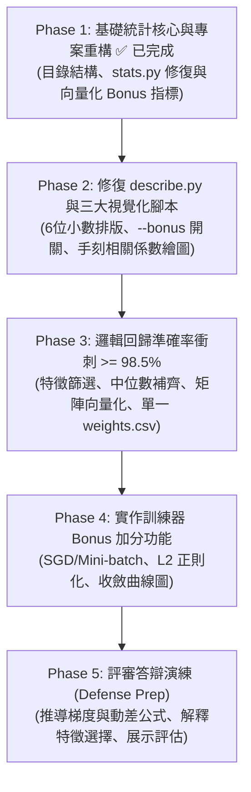
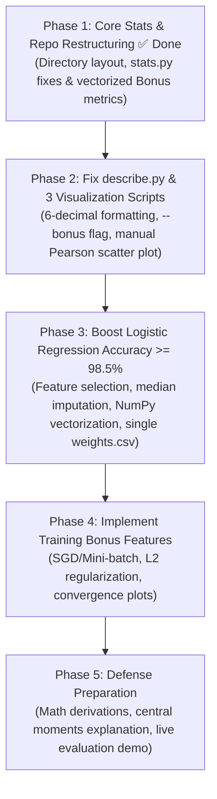

<p align="right">
  <a href="#dslr-project-audit-and-todo-list">
    
  </a>
</p>

# DSLR 專案審查與改善待辦清單

## 1. 專案審查總覽 (Executive Summary)

經過深入對比 `en.subject.pdf` 規範與 `~/dslr/README.md` 設計，我們已率先完成 **目錄結構模組化、`requirements.txt`、`.gitignore` 以及 `src/utils/stats.py`（含基礎指標修復與全部 Bonus 統計函式之向量化實作）**。接下來需聚焦修復 `src/` 下各主程式的輸出、視覺化呈現與邏輯回歸準確率。

### 現狀快速評估表

| 模組 / 檔案 | 狀態 | 核心問題 / 進度摘要 | 嚴重程度 |
| :--- | :---: | :--- | :---: |
| `src/utils/stats.py` | ✅ **已完成 (含 Bonus)** | 已修復 `dfpercentile` 越界 Bug、改寫 $O(N)$ `dfmin`/`dfmax`，並以合規向量化完成 `dfvar`, `dfstd`, `dfrange`, `dfiqr`, `dfskew`, `dfkurt`, `dfmissing_pct`, `dfunique`, `pearson_corr`。 | **Done** |
| 專案結構與依賴 | ✅ **已完成** | 已重構 `data/`, `docs/`, `src/`, `src/utils/`，修正所有相對 `import`，並建立 `requirements.txt` 與 `.gitignore`。 | **Done** |
| `src/describe.py` | ❌ 致命未完成 | 主函式 `print()` 遭到註解，執行毫無任何輸出；表格排版被 Pandas 截斷 (`...`)，未格式化至小數點後 6 位，尚未串接 `--bonus` 統計列。 | **Critical** |
| `src/histogram.py` | ⚠️ 待修整 | 殘留大量註解死碼；未以半透明疊加繪圖（可讀性差）；未於終端或圖表標題明確回答問題。 | **Medium** |
| `src/scatter_plot.py` | ⚠️ 違規風險 | 仍調用 Pandas 高階 `.corr()` 與 `.idxmax()`（應改用 `stats.pearson_corr`）；未依學院上色；未印出結論。 | **High** |
| `src/pair_plot.py` | ⚠️ 未落實反饋 | 繪圖僅繪製下三角；最關鍵的是**未將圖表觀察成果應用於特徵篩選**（後續訓練仍無腦全取）。 | **Medium** |
| `src/logreg_train.py` | ❌ 準確率未達標 & 違規 | 驗證準確率僅 **97.19%**（未達 98% 門檻）；無特徵篩選；固定 100 輪未收斂；大量使用 `.mean()`, `.sum()` 等違規方法。 | **Critical** |
| `src/logreg_predict.py`| ❌ 致命檔案衝突 | 訓練腳本產出兩份權重檔，若載入 `model_weights.csv` 會因缺少 `mean`/`std` 噴 `KeyError` 崩潰；CLI 提示錯誤。 | **Critical** |

---

## 2. Mandatory 基礎必做項目審查與待修正清單

### 2.1 描述性統計：`src/describe.py` 與 `src/utils/stats.py`

#### 缺陷與修復進度：
1. **[致命 Bug] `src/describe.py` 輸出被註解，執行空無一物（待修復）**：
   - 在 `src/describe.py` 第 30–32 行，`# print(describe(dataset))` 被註解掉，執行時終端完全無輸出。
2. **[未符合規範] `src/describe.py` 輸出格式未依題目要求排版（待修復）**：
   - 題目要求行標籤首字母大寫：`Count`, `Mean`, `Std`, `Min`, `25%`, `50%`, `75%`, `Max`（目前為全小寫）。
   - 題目要求數值格式化至小數點後 6 位（`%.6f`），且不得被 Pandas 省略號（`...`）截斷欄位。
3. **[已修復] `src/utils/stats.py` 越界與效能問題**：
   - 已修復 `dfpercentile` 缺少 `else` 分支之 `IndexError` 風險，並將 `dfmin`/`dfmax` 改為 $O(N)$ 走訪、回傳型別統一為 `float64`。

#### 待辦清單 (TODO)：
- [x] 修復 `src/utils/stats.py` 的 `dfpercentile()` 邏輯分支與 `dfmin()`/`dfmax()` $O(N)$ 走訪。
- [ ] 修復 `src/describe.py` 的 `main()`，取消註解並標準化印出統計結果。
- [ ] 統一修改 `src/describe.py` 統計標籤大小寫為：`Count`, `Mean`, `Std`, `Min`, `25%`, `50%`, `75%`, `Max`，並加入 `--bonus` 參數以顯示擴充指標。
- [ ] 撰寫排版格式化函式，將所有浮點數以固定 6 位小數（`{val:12.6f}`）印出，防止欄位被省略號截斷。

---

### 2.2 資料視覺化：`src/histogram.py`, `src/scatter_plot.py`, `src/pair_plot.py`

#### 存在缺陷與違規：
1. **`src/histogram.py` (回答哪門課程分數分佈在四學院間最均勻)**：
   - 包含大量註解死碼；`ax.hist(notes, bins=20)` 繪製成 4 根並排細條而非半透明重疊長條圖（`alpha=0.5`）；未印出核心答案：`Care of Magical Creatures` 與 `Arithmancy`。
2. **`src/scatter_plot.py` (回答哪兩門特徵最相似)**：
   - **[高風險違規]**：第 19 行調用了 Pandas 內建 `matieres.corr(method="pearson").abs()` 與 `.idxmax()`。應改用我們已在 `src/utils/stats.py` 實作好的 `st.pearson_corr()`！
   - 散布圖未依四學院著色（紅、黃、藍、綠）與加上圖例，也未印出最相似特徵為 `Astronomy` 與 `Defense Against the Dark Arts`（$r = -1.0$）。
3. **`src/pair_plot.py` (從圖表決定邏輯回歸該使用哪些特徵)**：
   - 使用 `corner=True` 僅畫出下半部；且觀察到的特徵篩選結論未被 `logreg_train.py` 採用。

#### 待辦清單 (TODO)：
- [ ] 清理 `src/histogram.py` 死碼，改用半透明重疊圖（`alpha=0.4`），並在終端印出結論：**`Care of Magical Creatures` 與 `Arithmancy` 分佈最均勻，應予以剔除**。
- [ ] 改寫 `src/scatter_plot.py`：呼叫 `utils.stats.pearson_corr()` 計算兩兩特徵相關係數；散布圖依學院顏色分類繪製，並印出結論：**`Astronomy` 與 `Defense Against the Dark Arts` 完全負相關（$r = -1.0$），只需保留其一**。
- [ ] 調整 `src/pair_plot.py` 為完整散布圖矩陣，並輸出清晰的特徵選擇結論。

---

### 2.3 邏輯回歸分類器：`src/logreg_train.py` 與 `src/logreg_predict.py`

#### 存在缺陷與違規：
1. **[評分不及格] 驗證準確率未達 98% 門檻（目前僅 97.19%）**：
   - 原因：固定僅跑 `range(100)` 輪未收斂、`holdOut` 捨棄了 20% 訓練資料、未剔除雜訊與共線性特徵、缺失值使用均值填補（標準化後補 0）而非中位數填補。
2. **[致命 Bug] 權重檔案衝突與崩潰**：
   - `logreg_train.py` 同時輸出 `model_weights.csv`（無 `mean`/`std`）與 `modele.csv`（含 `mean`/`std`）。若將 `model_weights.csv` 傳給 `logreg_predict.py` 會直接觸發 `KeyError: 'mean'` 崩潰。
3. **[違規風險] 調用禁止的高階統計函式**：
   - 訓練與預測腳本中多次直接調用 Pandas `.sum(axis=1)`, `.max()`, `.mean()`, `.idxmax(axis=1)`。

#### 待辦清單 (TODO)：
- [ ] 統一權重輸出檔名為 `weights.csv`（整合特徵清單、中位數、均值、標準差與 4 學院權重），移除多餘的 `model_weights.csv` 與 `modele.csv`。
- [ ] 導入特徵篩選（剔除 `Care of Magical Creatures`, `Arithmancy` 以及 `Defense Against the Dark Arts`）。
- [ ] 將資料預處理改為「以 `stats.dfpercentile(df, 50)` 中位數補齊缺失值」+「Z-score 標準化」。
- [ ] 將梯度下降改為 NumPy 向量化矩陣運算，迭代輪數提升至 1000–2000 輪，確保準確率超越 **98.5% ~ 99%**。
- [ ] 修正 `src/logreg_predict.py` 的 CLI 參數提示訊息，清理未使用的冗餘 `import`。

---

## 3. 架構規範與程式碼品質改進 (Refactoring Progress)

```bash
gau_dslr/
├── docs/
│   ├── en.subject.pdf          # [已完成] 題目說明書
│   └── TODO.md                 # [已完成] 本改善待辦清單
├── data/
│   ├── dataset_train.csv       # [已完成] 訓練集
│   └── dataset_test.csv        # [已完成] 測試集
├── src/
│   ├── describe.py             # [待更新] 描述性統計 (CLI)
│   ├── histogram.py            # [待更新] 特徵直方圖分析 (CLI)
│   ├── scatter_plot.py         # [已移入 src/，待更新] 特徵散布圖與相似度分析
│   ├── pair_plot.py            # [待更新] 配對圖與特徵選擇分析
│   ├── logreg_train.py         # [待更新] 模型訓練 (CLI，支援 Bonus 參數)
│   ├── logreg_predict.py       # [待更新] 模型預測並輸出 houses.csv
│   └── utils/
│       ├── __init__.py         # [已完成] 匯出所有手刻統計函式
│       ├── stats.py            # [已完成] 手刻純統計與向量化 Bonus 函式庫
│       ├── preprocessor.py     # [待建立] 缺失值填補 (Median) 與 Z-score 標準化
│       └── model.py            # [待建立] 邏輯回歸類別 (支援 BGD, SGD, Mini-batch, L2)
├── weights.csv                 # [待統一] 訓練輸出之標準化權重檔
├── houses.csv                  # 最終預測結果
├── requirements.txt            # [已完成] 必要依賴套件
├── .gitignore                  # [已完成] Git 忽略規則
└── README.md                   # [待同步] 完整專案指南
```

### 待辦清單 (TODO)：
- [x] 建立 `requirements.txt` 與更新 `.gitignore`。
- [x] 將 `scatter_plot.py` 移入 `src/`，將 `stats.py` 移入 `src/utils/` 並建立 `src/utils/__init__.py`。
- [x] 修正 `src/` 下所有檔案的相對 `import` 路徑。
- [ ] 建立 `src/utils/preprocessor.py` 與 `src/utils/model.py`（或直接整合於訓練與預測模組中）。

---

## 4. Bonus 加分項目詳細實作指南與數學定義 (Bonus Implementation Plan)

### Bonus 1: `src/utils/stats.py` 擴充統計指標與嚴謹數學定義（✅ 已完成實作）

我們已在 `src/utils/stats.py` 中利用 **「複用手刻基礎函式 + 底層 NumPy/Pandas 陣列向量化（Vectorization）」** 實作了以下 9 項進階統計與相關性指標，完全避開禁用函式並大幅提升運算速度。以下為各項指標之數學定義與口試答辯解析：

#### 1. 無偏樣本變異數 (Unbiased Sample Variance — `dfvar`)
- **數學定義**：
  設有效非空樣本為 $x_1, x_2, \dots, x_n$，算術平均數為 $\bar{x} = \frac{1}{n}\sum_{i=1}^{n} x_i$：
  $$s^2 = \frac{1}{n - 1} \sum_{i=1}^{n} (x_i - \bar{x})^2$$
- **統計意義（Bessel's Correction 貝索校正）**：
  衡量資料偏離平均數的平方平均距離。分母除以 $n - 1$（自由度 $\text{ddof} = 1$）而非 $n$，是因為計算離差 $(x_i - \bar{x})$ 時已受限於 $\sum (x_i - \bar{x}) = 0$ 這一個線性約束，喪失了 1 個自由度；除以 $n - 1$ 才能確保樣本變異數 $s^2$ 是母體變異數 $\sigma^2$ 的**無偏估計量（Unbiased Estimator，$\mathbb{E}[s^2] = \sigma^2$）**。

#### 2. 無偏樣本標準差 (Unbiased Sample Standard Deviation — `dfstd`)
- **數學定義**：
  $$s = \sqrt{s^2} = \sqrt{\frac{1}{n - 1} \sum_{i=1}^{n} (x_i - \bar{x})^2}$$
- **統計意義**：
  將變異數開平方根，使單位（量綱）還原至與原始特徵一致，並作為後續 Z-score 標準化 $z = \frac{x - \bar{x}}{s}$ 的縮放基準。在 `stats.py` 中直接以單行 Series 向量化 `return dfvar(dataframe) ** 0.5` 實作。

#### 3. 全距 (Range — `dfrange`)
- **數學定義**：
  $$\text{Range} = x_{\max} - x_{\min} = \max_{1 \le i \le n} x_i - \min_{1 \le i \le n} x_i$$
- **統計意義**：
  衡量資料分佈的總跨度（極差）。對極端值（Outliers）極為敏感，可用於一眼看出不同魔法課程的分數尺度差異（例如 `Arithmancy` 全距超過 $1.29 \times 10^5$，而 `Herbology` 僅約 $21.9$），直接證明為何梯度下降前必須進行特徵標準化。

#### 4. 四分位距 (Interquartile Range — `dfiqr`)
- **數學定義**：
  $$\text{IQR} = Q_{75\%} - Q_{25\%}$$
  其中 $Q_{p}$ 為透過線性插值法求得之第 $p$ 百分位數。
- **統計意義**：
  衡量排序後中間 $50\%$ 核心樣本的分散程度。相較於全距與標準差，IQR 完全不受首尾各 $25\%$ 極端離群值的干擾，是**強健統計學（Robust Statistics）**中最重要的離散度指標（亦常用於定義箱型圖異常值邊界 $[Q_{25\%} - 1.5\,\text{IQR},\ Q_{75\%} + 1.5\,\text{IQR}]$）。

#### 5. 偏態係數 (Fisher-Pearson Coefficient of Skewness — `dfskew`)
- **數學定義**：
  定義第 $k$ 階樣本中心動差（$k$-th Central Moment）為 $m_k = \frac{1}{n} \sum_{i=1}^{n} (x_i - \bar{x})^k$，則偏態係數 $g_1$ 為經標準化後的三階中心動差：
  $$g_1 = \frac{m_3}{m_2^{3/2}} = \frac{\frac{1}{n}\sum_{i=1}^{n} (x_i - \bar{x})^3}{\left[\frac{1}{n}\sum_{i=1}^{n} (x_i - \bar{x})^2\right]^{3/2}}$$
- **統計意義**：
  - 衡量資料機率分佈相對於平均數的**左右不對稱程度（Asymmetry）**。
  - 分子的三次方 $(x_i - \bar{x})^3$ 保留了正負號，且會強烈放大遠離均值的長尾離群值；分母 $m_2^{3/2}$ 則消除資料尺度的影響（無因次化）。
  - **判讀基準**：
    - $g_1 \approx 0$：分佈大致左右對稱（注意：$g_1 = 0$ 是對稱的必要非充分條件，正負方向的三次偏差亦可能剛好抵消）。
    - $g_1 > 0$：**右偏／正偏態（Right-skewed）**，右側具長尾（少數極高分拉高平均數，通常 $\text{Mean} > \text{Median}$）。
    - $g_1 < 0$：**左偏／負偏態（Left-skewed）**，左側具長尾（少數極低分拉低平均數，通常 $\text{Mean} < \text{Median}$）。

#### 6. 超額峰態係數 (Excess Kurtosis, Fisher's Definition — `dfkurt`)
- **數學定義**：
  以四階中心動差 $m_4$ 與二階中心動差平方 $m_2^2$ 之比值減去常態分佈基準值 $3$：
  $$g_2 = \frac{m_4}{m_2^2} - 3 = \frac{\frac{1}{n}\sum_{i=1}^{n} (x_i - \bar{x})^4}{\left[\frac{1}{n}\sum_{i=1}^{n} (x_i - \bar{x})^2\right]^2} - 3$$
- **統計意義**：
  - 衡量資料分佈的**尾端厚度（Tail Heaviness）與峰部尖銳度**，反映極端離群值（Outliers）出現的機率高低。
  - 公式中的 4 次方 $(x_i - \bar{x})^4$ 會極端放大遠離平均數的異常值貢獻。
  - **為什麼要減 3？** 標準常態分佈 $\mathcal{N}(\mu, \sigma^2)$ 的原始峰度 $\frac{m_4}{m_2^2}$ 恆等於 $3$。減去 $3$ 後得到的**超額峰度（Excess Kurtosis）**以 $0$ 為常態分佈基準：
    - $g_2 \approx 0$：**常態峰（Mesokurtic）**，尾部厚度與常態分佈一致。
    - $g_2 > 0$：**高狹峰／厚尾分佈（Leptokurtic）**，尖峰且肥尾，極端值出現機率高於常態分佈。
    - $g_2 < 0$：**低闊峰／薄尾分佈（Platykurtic）**，分佈較平緩（例如連續均勻分佈的 $g_2 = -1.2$），極端值少於常態分佈。

#### 7. 缺失值百分比 (Missing Value Percentage — `dfmissing_pct`)
- **數學定義**：
  設資料集總樣本列數為 $N_{\text{total}}$，該欄位非空有效樣本數為 $n = \text{Count}(x)$：
  $$\text{Missing\%} = \frac{N_{\text{total}} - n}{N_{\text{total}}} \times 100\%$$
- **統計意義**：
  衡量各特徵的資料遺失率（本專案各課程約有 $1.8\% \sim 2.5\%$ 的缺失率），證明若直接整列刪除（Drop Rows）將損失大量樣本，因此必須採用中位數填補（Median Imputation）。

#### 8. 不重複有效值數量 (Unique Non-NaN Count — `dfunique`)
- **數學定義**：
  $$\text{Unique}(x) = \left| \left\{ x_i \;\middle|\; x_i \text{ is not NaN},\ 1 \le i \le N_{\text{total}} \right\} \right|$$
- **統計意義**：
  利用集合（Set）互異性計算有效觀測值之基數（Cardinality），用以確認特徵屬於高基數之連續型浮點數（不適用眾數 Mode 填補）或離散型數值。

#### 9. 皮爾森積動差相關係數 (Pearson Correlation Coefficient — `pearson_corr`)
- **數學定義**：
  給定兩特徵欄位共同非空之配對觀測集 $\{(x_i, y_i)\}_{i=1}^{n}$，其樣本均值分別為 $\bar{x} = \frac{1}{n}\sum x_i$ 與 $\bar{y} = \frac{1}{n}\sum y_i$：
  $$r_{xy} = \frac{\sum_{i=1}^{n} (x_i - \bar{x})(y_i - \bar{y})}{\sqrt{\sum_{i=1}^{n} (x_i - \bar{x})^2} \sqrt{\sum_{i=1}^{n} (y_i - \bar{y})^2}} \in [-1, 1]$$
- **統計意義**：
  即標準化後的共變異數（$\frac{\text{Cov}(X, Y)}{\sigma_X \sigma_Y}$），衡量兩變數之間的**線性相關強度與方向**。當 $|r_{xy}| \to 1$ 時代表兩特徵高度共線性（如 `Astronomy` 與 `Defense Against the Dark Arts` 的 $r_{xy} = -1.0$），為 `scatter_plot.py` 提供完全合規的手刻計算核心。

---

### Bonus 2: 實作多種優化演算法 (Optimizers)

#### 實作目標：
在 `src/logreg_train.py` 支援三種不同的梯度下降優化策略：
1. **批次梯度下降 (Batch Gradient Descent, BGD)**：
   - 每次更新使用所有 $m$ 筆訓練樣本：
     $$\theta := \theta - \frac{\alpha}{m} X^T (h_\theta(X) - y)$$
2. **隨機梯度下降 (Stochastic Gradient Descent, SGD)**：
   - 每輪 Epoch 隨機打亂資料（Shuffle），逐筆樣本更新權重：
     $$\theta := \theta - \alpha (h_\theta(x^{(i)}) - y^{(i)}) x^{(i)}$$
3. **小批次梯度下降 (Mini-batch Gradient Descent, MBGD)**：
   - 每次選取批次大小 $B$（如 $B=32$）的樣本計算梯度：
     $$\theta := \theta - \frac{\alpha}{B} X_{\text{batch}}^T (h_\theta(X_{\text{batch}}) - y_{\text{batch}})$$

#### 程式碼實作方式 (`src/utils/model.py` 或 `src/logreg_train.py`)：
```python
def train_step(self, X: np.ndarray, y: np.ndarray, optimizer="bgd", batch_size=32, lr=0.1, epochs=1000):
    m, n = X.shape
    for epoch in range(epochs):
        if optimizer == "bgd":
            p = self.sigmoid(X @ self.theta)
            grad = (X.T @ (p - y)) / m
            self.theta -= lr * grad
        elif optimizer == "sgd":
            indices = np.random.permutation(m)
            for i in indices:
                xi = X[i:i+1]
                yi = y[i:i+1]
                p = self.sigmoid(xi @ self.theta)
                grad = xi.T @ (p - yi)
                self.theta -= lr * grad.flatten()
        elif optimizer == "minibatch":
            indices = np.random.permutation(m)
            for start in range(0, m, batch_size):
                batch_idx = indices[start:start+batch_size]
                X_b, y_b = X[batch_idx], y[batch_idx]
                p = self.sigmoid(X_b @ self.theta)
                grad = (X_b.T @ (p - y_b)) / len(y_b)
                self.theta -= lr * grad
```
- [ ] 支援命令列參數：`python3 src/logreg_train.py data/dataset_train.csv --optimizer [bgd|sgd|minibatch] --batch_size 32`。

---

### Bonus 3: 正則化機制 ($L_2$ Regularization / Ridge)

#### 實作目標：
防止模型參數過大造成過度擬合（Overfitting），在損失函數中加入 $L_2$ 懲罰項：
$$J_{reg}(\theta) = J(\theta) + \frac{\lambda}{2m} \sum_{j=1}^{n} \theta_j^2$$
梯度更新公式（**注意：Bias 項 $\theta_0$ 不參與正則化**）：
$$\frac{\partial J_{reg}(\theta)}{\partial \theta_j} = \frac{1}{m} \sum_{i=1}^{m} (h_\theta(x^{(i)}) - y^{(i)})x_j^{(i)} + \frac{\lambda}{m} \theta_j \quad (j \ge 1)$$

#### 待辦清單 (TODO)：
- [ ] 支援 `--lambda` 懲罰係數參數（預設 `0.0`，可設為 `0.01`）。

---

### Bonus 4: 學習曲線視覺化與 Early Stopping

#### 實作目標：
1. **記錄訓練與驗證損失**：在每個 Epoch 結束時記錄 Binary Cross-Entropy 損失與當前準確率。
2. **學習曲線繪圖 (`--plot` 開關)**：繪製 $Loss \text{ vs. } Epochs$ 曲線，直觀比較 BGD、Mini-batch GD 與 SGD 的收斂動態。
3. **早停機制 (Early Stopping)**：當損失連續 $P$ 個 Epochs 未再顯著下降時自動終止訓練。

#### 待辦清單 (TODO)：
- [ ] 實作 `--plot` 與 `--early-stopping` 參數。

---

### Bonus 5: 自我驗證與口試答辯評估工具 (`src/evaluate.py`)

#### 待辦清單 (TODO)：
- [ ] 撰寫 `src/evaluate.py`，支援 5-Fold 交叉驗證、混淆矩陣與 `sklearn.metrics.accuracy_score` 驗證（確保穩定 $\ge 98.0\%$）。

---

## 5. 執行改善路線圖 (Actionable Roadmap)



---

<br/>

---

<br/>

<p align="right">
  <a href="#dslr-專案審查與改善待辦清單">
    
  </a>
</p>

# DSLR Project Audit and TODO List

> **File Path**: `~/dslr/docs/TODO.md`
> **References**: `en.subject.pdf` (Version 5) and `~/dslr/README.md`  
> **Audit Scope**: Comprehensive verification of `~/dslr`, tracking completed and remaining tasks, critical bugs, rule violations, and providing complete mathematical definitions and implementation guides for the Bonus Part.

---

## 1. Executive Summary

Following our audit against `en.subject.pdf` and `~/dslr/README.md`, we have **completed the repository restructuring, `requirements.txt`, `.gitignore`, and the full implementation & vectorization of `src/utils/stats.py` (including all Mandatory bug fixes and 9 Bonus statistical/correlation functions)**. Next steps focus on fixing the CLI output of `src/describe.py`, refining the visualization scripts, and upgrading `logreg_train.py` / `logreg_predict.py` to exceed the 98% accuracy threshold.

### Quick Status Assessment

| Module / File | Status | Core Issues & Progress Summary | Severity |
| :--- | :---: | :--- | :---: |
| `src/utils/stats.py` | ✅ **Completed (+ Bonus)** | Fixed `dfpercentile` `IndexError`, rewrote $O(N)$ `dfmin`/`dfmax`, and implemented vectorized `dfvar`, `dfstd`, `dfrange`, `dfiqr`, `dfskew`, `dfkurt`, `dfmissing_pct`, `dfunique`, and `pearson_corr`. | **Done** |
| Structure & Deps | ✅ **Completed** | Restructured into `data/`, `docs/`, `src/`, `src/utils/`; fixed relative imports; added `requirements.txt` and `.gitignore`. | **Done** |
| `src/describe.py` | ❌ Critical Unfinished | `print()` calls in `main()` are commented out (outputs nothing); Pandas truncates wide columns (`...`); not formatted to 6 decimal places; `--bonus` flag not wired yet. | **Critical** |
| `src/histogram.py` | ⚠️ Needs Cleanup | Cluttered with commented-out dead code; uses side-by-side bars instead of translucent overlapping histograms; does not explicitly state the answer. | **Medium** |
| `src/scatter_plot.py` | ⚠️ Rule Violation Risk | Still calls built-in `.corr()` and `.idxmax()` (should switch to `stats.pearson_corr`); points not colored by House; does not print the conclusion. | **High** |
| `src/pair_plot.py` | ⚠️ Disconnected | Plots only lower corner (`corner=True`); **findings are ignored in `logreg_train.py`** (all 13 features are blindly used). | **Medium** |
| `src/logreg_train.py` | ❌ Accuracy < 98% & Violations | Validation accuracy is only **97.19%** (< 98% requirement); no feature selection; fixed 100 epochs (unconverged); uses forbidden `.mean()`, `.sum()`, `.max()`. | **Critical** |
| `src/logreg_predict.py`| ❌ Crash Bug | Training outputs two weight files; passing `model_weights.csv` crashes with `KeyError: 'mean'`; incorrect CLI usage string. | **Critical** |

---

## 2. Mandatory Part Audit & TODO List

### 2.1 Descriptive Statistics: `src/describe.py` & `src/utils/stats.py`

#### Bugs & Fix Progress:
1. **[Critical Bug] `src/describe.py` produces zero output (Pending)**:
   - Lines 30–32 of `src/describe.py` have `# print(describe(dataset))` commented out.
2. **[Spec Non-compliance] `src/describe.py` output formatting (Pending)**:
   - Row labels must be capitalized (`Count`, `Mean`, `Std`, `Min`, `25%`, `50%`, `75%`, `Max`), numbers formatted to 6 decimal places (`%.6f`), and all columns displayed without `...` truncation.
3. **[Fixed] `src/utils/stats.py` boundary & performance bugs**:
   - Fixed `dfpercentile` missing `else` branch, rewrote `dfmin`/`dfmax` in $O(N)$ time, and unified return Series dtype to `float64`.

#### Actionable TODO:
- [x] Fix `dfpercentile()` boundary logic and rewrite $O(N)$ `dfmin()`/`dfmax()` in `src/utils/stats.py`.
- [ ] Uncomment and format the output in `src/describe.py`'s `main()`.
- [ ] Capitalize row labels (`Count`, `Mean`, `Std`, `Min`, `25%`, `50%`, `75%`, `Max`) and add a `--bonus` flag to display the extended metrics.
- [ ] Implement a custom table formatter with 6-decimal precision (`{val:12.6f}`) without column truncation.

---

### 2.2 Data Visualization: `src/histogram.py`, `src/scatter_plot.py`, `src/pair_plot.py`

#### Actionable TODO:
- [ ] Clean up dead code in `src/histogram.py`, plot overlapping translucent histograms (`alpha=0.4`), and clearly print the answer: **`Care of Magical Creatures` and `Arithmancy` have homogeneous distributions across all four houses and should be dropped**.
- [ ] Rewrite `src/scatter_plot.py` to use `utils.stats.pearson_corr()` instead of `df.corr()`, color points by `Hogwarts House`, and print the conclusion: **`Astronomy` and `Defense Against the Dark Arts` are redundant ($r = -1.0$); keep only one**.
- [ ] Update `src/pair_plot.py` to render the full matrix with histograms on the diagonal and print the selected feature list for logistic regression.

---

### 2.3 Logistic Regression: `src/logreg_train.py` & `src/logreg_predict.py`

#### Actionable TODO:
- [ ] Consolidate trained parameters into a single `weights.csv` (eliminating `model_weights.csv` and `modele.csv` so `KeyError: 'mean'` can never happen).
- [ ] Drop `Care of Magical Creatures`, `Arithmancy`, and `Defense Against the Dark Arts` during preprocessing.
- [ ] Impute missing values using manual **median** (`stats.dfpercentile(df, 50)`) prior to Z-score standardization.
- [ ] Vectorize gradient descent with NumPy (`X @ theta`) and increase iterations to 1000–2000 epochs so accuracy consistently exceeds **98.5% – 99%**.
- [ ] Remove all forbidden `.mean()`, `.sum()`, `.max()`, `.idxmax()` calls and clean up unused imports.

---

## 3. Refactoring & Architecture Progress

- [x] Create `requirements.txt` and update `.gitignore`.
- [x] Move `scatter_plot.py` into `src/`, move `stats.py` into `src/utils/`, and create `src/utils/__init__.py`.
- [x] Fix all relative `import` paths across `src/*.py`.
- [ ] Create `src/utils/preprocessor.py` and `src/utils/model.py` (or modularize within training/prediction scripts).
- [ ] Sync `~/dslr/README.md` to `~/gau_dslr/README.md`.

---

## 4. Bonus Part Implementation Guide & Mathematical Definitions

### Bonus 1: Extended Metrics in `src/utils/stats.py` & Mathematical Definitions (✅ Implemented)

We have implemented 9 bonus statistical and correlation functions in `src/utils/stats.py` by combining **from-scratch base functions with C-backed array vectorization**, strictly avoiding forbidden built-ins while achieving high performance. Below are the exact mathematical definitions and theoretical justifications for peer defense:

#### 1. Unbiased Sample Variance (`dfvar`)
- **Mathematical Definition**:
  Given valid non-`NaN` observations $x_1, x_2, \dots, x_n$ with arithmetic mean $\bar{x} = \frac{1}{n}\sum_{i=1}^{n} x_i$:
  $$s^2 = \frac{1}{n - 1} \sum_{i=1}^{n} (x_i - \bar{x})^2$$
- **Statistical Meaning (Bessel's Correction)**:
  Measures the average squared deviation from the sample mean. Dividing by $n - 1$ ($\text{ddof} = 1$) rather than $n$ corrects for the loss of 1 degree of freedom caused by estimating the population mean $\mu$ with the sample mean $\bar{x}$ (which imposes the linear constraint $\sum_{i=1}^n (x_i - \bar{x}) = 0$). This makes $s^2$ an **unbiased estimator** of the true population variance $\sigma^2$ ($\mathbb{E}[s^2] = \sigma^2$).

#### 2. Unbiased Sample Standard Deviation (`dfstd`)
- **Mathematical Definition**:
  $$s = \sqrt{s^2} = \sqrt{\frac{1}{n - 1} \sum_{i=1}^{n} (x_i - \bar{x})^2}$$
- **Statistical Meaning**:
  Restores the dispersion measure to the original unit of measurement of the feature and serves as the scaling denominator for Z-score standardization $z = \frac{x - \bar{x}}{s}$. Implemented in `stats.py` as a 1-line vectorized Series operation: `return dfvar(dataframe) ** 0.5`.

#### 3. Range (`dfrange`)
- **Mathematical Definition**:
  $$\text{Range} = x_{\max} - x_{\min} = \max_{1 \le i \le n} x_i - \min_{1 \le i \le n} x_i$$
- **Statistical Meaning**:
  Measures the total spread between extrema. Highly sensitive to outliers, it immediately highlights the drastic scale differences across Hogwarts courses (e.g., `Arithmancy` spans $> 1.29 \times 10^5$ whereas `Herbology` spans $\approx 21.9$), demonstrating why feature standardization is mandatory before running gradient descent.

#### 4. Interquartile Range (`dfiqr`)
- **Mathematical Definition**:
  $$\text{IQR} = Q_{75\%} - Q_{25\%}$$
  where $Q_p$ denotes the $p$-th percentile computed via linear interpolation.
- **Statistical Meaning**:
  Captures the spread of the middle $50\%$ of sorted data. Unlike Range or Standard Deviation, the IQR is completely immune to extreme outliers in the top and bottom $25\%$ tails, making it the cornerstone dispersion metric in **Robust Statistics** (and the basis for Tukey's outlier fence $[Q_{25\%} - 1.5\,\text{IQR},\ Q_{75\%} + 1.5\,\text{IQR}]$).

#### 5. Fisher-Pearson Coefficient of Skewness (`dfskew`)
- **Mathematical Definition**:
  Let the $k$-th sample central moment be $m_k = \frac{1}{n} \sum_{i=1}^{n} (x_i - \bar{x})^k$. The sample skewness $g_1$ is the standardized third central moment:
  $$g_1 = \frac{m_3}{m_2^{3/2}} = \frac{\frac{1}{n}\sum_{i=1}^{n} (x_i - \bar{x})^3}{\left[\frac{1}{n}\sum_{i=1}^{n} (x_i - \bar{x})^2\right]^{3/2}}$$
- **Statistical Meaning**:
  - Quantifies the **asymmetry** of a probability distribution around its mean.
  - Raising deviations $(x_i - \bar{x})$ to the 3rd power preserves their sign ($+$ or $-$) while heavily amplifying distant tail values; dividing by $m_2^{3/2}$ makes the metric dimensionless (scale-invariant).
  - **Interpretation**:
    - $g_1 \approx 0$: Roughly symmetric distribution (note: $g_1 = 0$ does not strictly guarantee symmetry if asymmetric positive and negative cubic deviations cancel out).
    - $g_1 > 0$: **Right-skewed (Positive skew)** — longer right tail; extreme high scores pull the mean above the median ($\text{Mean} > \text{Median}$).
    - $g_1 < 0$: **Left-skewed (Negative skew)** — longer left tail; extreme low scores pull the mean below the median ($\text{Mean} < \text{Median}$).

#### 6. Excess Kurtosis — Fisher's Definition (`dfkurt`)
- **Mathematical Definition**:
  Defined as the standardized fourth central moment $\frac{m_4}{m_2^2}$ minus the normal baseline of $3$:
  $$g_2 = \frac{m_4}{m_2^2} - 3 = \frac{\frac{1}{n}\sum_{i=1}^{n} (x_i - \bar{x})^4}{\left[\frac{1}{n}\sum_{i=1}^{n} (x_i - \bar{x})^2\right]^2} - 3$$
- **Statistical Meaning**:
  - Measures **tail heaviness (outlier propensity) and peak sharpness** relative to a normal distribution.
  - Raising deviations to the 4th power makes $m_4$ overwhelmingly sensitive to extreme outliers far from the mean.
  - **Why subtract 3?** For any Gaussian distribution $\mathcal{N}(\mu, \sigma^2)$, Pearson's raw kurtosis $\frac{m_4}{m_2^2}$ is fixed at $3$. Subtracting $3$ (Fisher's definition) centers **Excess Kurtosis** at $0$:
    - $g_2 \approx 0$: **Mesokurtic** — tail weight matches a normal distribution.
    - $g_2 > 0$: **Leptokurtic (Heavy-tailed / Sharp peak)** — higher probability of extreme outliers than a normal distribution.
    - $g_2 < 0$: **Platykurtic (Light-tailed / Flat peak)** — fewer extreme outliers than a normal distribution (e.g., a uniform distribution has $g_2 = -1.2$).

#### 7. Missing Value Percentage (`dfmissing_pct`)
- **Mathematical Definition**:
  Given total dataset rows $N_{\text{total}}$ and valid non-`NaN` count $n = \text{Count}(x)$:
  $$\text{Missing\%} = \frac{N_{\text{total}} - n}{N_{\text{total}}} \times 100\%$$
- **Statistical Meaning**:
  Quantifies data incompleteness per column ($\approx 1.8\%\text{–}2.5\%$ per course in `dataset_train.csv`), justifying median imputation over row deletion.

#### 8. Unique Non-NaN Count (`dfunique`)
- **Mathematical Definition**:
  $$\text{Unique}(x) = \left| \left\{ x_i \;\middle|\; x_i \text{ is not NaN},\ 1 \le i \le N_{\text{total}} \right\} \right|$$
- **Statistical Meaning**:
  Computes the cardinality $|\mathcal{S}|$ of the set of distinct valid observations, distinguishing continuous floating-point features from discrete categorical features.

#### 9. Pearson Correlation Coefficient (`pearson_corr`)
- **Mathematical Definition**:
  Given $n$ paired non-`NaN` observations $\{(x_i, y_i)\}_{i=1}^{n}$ with sample means $\bar{x} = \frac{1}{n}\sum x_i$ and $\bar{y} = \frac{1}{n}\sum y_i$:
  $$r_{xy} = \frac{\sum_{i=1}^{n} (x_i - \bar{x})(y_i - \bar{y})}{\sqrt{\sum_{i=1}^{n} (x_i - \bar{x})^2} \sqrt{\sum_{i=1}^{n} (y_i - \bar{y})^2}} \in [-1, 1]$$
- **Statistical Meaning**:
  Normalized covariance ($\frac{\text{Cov}(X, Y)}{\sigma_X \sigma_Y}$) measuring the **strength and direction of linear association** between two features. Powers `src/scatter_plot.py` to detect collinear features ($r_{xy} = -1.0$ between `Astronomy` and `Defense Against the Dark Arts`) without calling `df.corr()`.
---

### Bonus 2: Stochastic Gradient Descent (SGD) & Mini-Batch GD

#### Target Optimizers:
1. **Batch Gradient Descent (BGD — Default)**:
   $$\theta := \theta - \frac{\alpha}{m} X^T (h_\theta(X) - y)$$
2. **Stochastic Gradient Descent (SGD)**:
   $$\theta := \theta - \alpha (h_\theta(x^{(i)}) - y^{(i)}) x^{(i)}$$
3. **Mini-Batch Gradient Descent (MBGD)**:
   $$\theta := \theta - \frac{\alpha}{B} X_{\text{batch}}^T (h_\theta(X_{\text{batch}}) - y_{\text{batch}})$$

- [ ] Add CLI flags: `python3 src/logreg_train.py data/dataset_train.csv --optimizer [bgd|sgd|minibatch] --batch_size 32`.

---

### Bonus 3: $L_2$ Regularization (Ridge)

$$J_{reg}(\theta) = J(\theta) + \frac{\lambda}{2m} \sum_{j=1}^{n} \theta_j^2, \qquad \frac{\partial J_{reg}(\theta)}{\partial \theta_j} = \frac{1}{m} \sum_{i=1}^{m} (h_\theta(x^{(i)}) - y^{(i)})x_j^{(i)} + \frac{\lambda}{m} \theta_j \quad (j \ge 1)$$

- [ ] Add `--lambda` CLI flag (default `0.0`).

---

### Bonus 4: Learning Curve Visualization & Early Stopping

- [ ] Implement `--plot` (comparing BGD, Mini-batch GD, and SGD loss curves) and `--early-stopping` flags in `src/logreg_train.py`.

---

### Bonus 5: Self-Evaluation & Defense Script (`src/evaluate.py`)

- [ ] Create `src/evaluate.py` to run 5-Fold Cross-Validation and print the Confusion Matrix, Precision, Recall, F1-Score, and `sklearn.metrics.accuracy_score` ($\ge 98.0\%$).

---

## 5. Actionable Execution Roadmap


