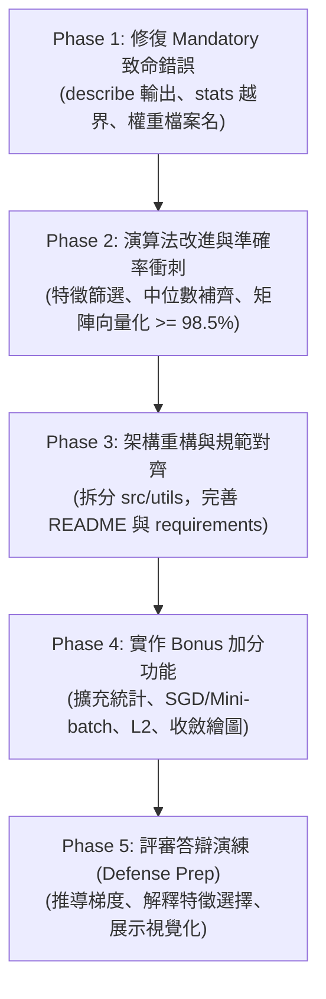
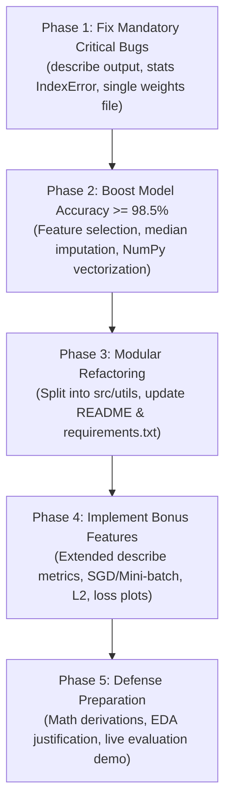

# DSLR 專案審查與改善待辦清單

<p align="right">
  <a href="#dslr-project-audit-and-todo-list">
    
  </a>
</p>

> **文件路徑**：`~/dslr/docs/TODO.md`  
> **參考依據**：`en.subject.pdf` (Version 5) 與 `~/dslr/README.md`  
> **審查目標**：針對 `~/gau_dslr` 現有代碼進行完整盤點，列出未完成事項、致命 Bug、評分違規風險，並提供完整的加分項目 (Bonus Part) 實作指南與改善路線圖。

---

## 1. 專案審查總覽 (Executive Summary)

經過深入對比 `en.subject.pdf` 規範與 `~/dslr/README.md` 設計，`~/gau_dslr` 雖然已具備基本原型骨架，但存在**數個導致評分 0 分的致命缺陷、禁止函式違規風險、模型驗證準確率未達 98% 門檻**，且完全尚未實作任何加分功能。

### 現狀快速評估表

| 模組 / 檔案 | 狀態 | 核心問題 / 缺失摘要 | 嚴重程度 |
| :--- | :---: | :--- | :---: |
| `describe.py` | ❌ 致命未完成 | 主函式 `print()` 遭到註解，執行毫無任何輸出；表格排版被 Pandas 截斷 (`...`)，未格式化至小數點後 6 位。 | **Critical** |
| `stats.py` | ⚠️ 有潛在崩潰 Bug | `dfpercentile` 遺漏 `else`，可能觸發 `IndexError`；`dfmin`/`dfmax` 依賴全排序；型別初始化不當。 | **High** |
| `histogram.py` | ⚠️ 待修整 | 殘留大量註解死碼；未以半透明疊加繪圖（可讀性差）；未於終端或圖表標題明確回答問題。 | **Medium** |
| `scatter_plot.py` | ⚠️ 違規風險 | 違規調用 Pandas 高階 `.corr()` 與 `.idxmax()` 獲取關聯；未依學院上色；未印出結論。 | **High** |
| `pair_plot.py` | ⚠️ 未落實反饋 | 繪圖僅繪製下三角；最關鍵的是**未將圖表觀察成果應用於特徵篩選**（後續訓練仍無腦全取）。 | **Medium** |
| `logreg_train.py` | ❌ 準確率未達標 & 違規 | 驗證準確率僅 **97.19%**（未達 98% 門檻）；無特徵篩選；固定 100 輪未收斂；大量使用 `.mean()`, `.sum()` 等違規方法。 | **Critical** |
| `logreg_predict.py`| ❌ 致命檔案衝突 | 訓練腳本產出兩份權重檔，若載入 `model_weights.csv` 會因缺少 `mean`/`std` 噴 `KeyError` 崩潰；CLI 提示錯誤。 | **Critical** |
| Bonus 加分項目 | ❌ 完全未實作 | 擴充統計指標、SGD、Mini-batch GD、正則化、學習曲線等均未實作。 | **Bonus** |
| 專案結構與文件 | ⚠️ 未符合規範 | `README.md` 僅有標題一行；缺少 `requirements.txt`；未依規範進行模組化分層。 | **Medium** |

---

## 2. Mandatory 基礎必做項目審查與待修正清單

### 2.1 描述性統計：`describe.py` 與 `stats.py`

#### 存在缺陷與違規：
1. **[致命 Bug] `describe.py` 輸出被註解，執行空無一物**：
   - 在 `~/gau_dslr/describe.py` 第 31–33 行：
     ```python
     # describe(dataset)
     # print(dataset.describe())
     # print(describe(dataset))
     ```
     執行 `python3 describe.py datasets/dataset_train.csv` 時終端完全沒有輸出任何內容，評分時會被判定為未實作！
2. **[致命 Bug] `stats.py` 中 `dfpercentile` 存在越界風險**：
   - 在 `~/gau_dslr/stats.py` 第 69–74 行：
     ```python
     if k - kentier == 0:
         resultats.loc[col] = sorted.iloc[kentier]
     fraction = k - kentier
     resultats.loc[col] = sorted.iloc[kentier] + fraction * (sorted.iloc[kentier+1]-sorted.iloc[kentier])
     ```
     由於 `if` 區塊內缺少 `continue` 或 `else`，第 73 行永遠會被執行。當計算 `prct=100` 或資料僅有 1 個非空值（`count[col] == 1` 時 `k = 0`, `kentier = 0`），存取 `kentier + 1` 會直接拋出 `IndexError: single positional indexer is out-of-bounds` 崩潰。
3. **[未符合規範] 輸出格式未依題目要求排版**：
   - 題目範例要求行標籤為首字母大寫：`Count`, `Mean`, `Std`, `Min`, `25%`, `50%`, `75%`, `Max`；目前為全小寫。
   - 題目要求數值格式化至小數點後 6 位（`%.6f`）。
   - Pandas 預設列印 14 個數值欄位時，中間會被截斷為省略號（`...`），評審無法檢視完整欄位統計數據，必須自行排版字串或設定 `pd.set_option('display.max_columns', None)`。
4. **[潛在風險] `dfmin` 與 `dfmax` 效率低且不健壯**：
   - `stats.py` 中透過 `dataframe[col].sort_values().iloc[0]` 獲取極值，時間複雜度為 $O(N \log N)$ 且若欄位全為 `NaN` 行為不可靠；應改為一次性走訪的 $O(N)$ 比較。
5. **[型別警告]**：
   - `stats.py` 初始化 Series 時使用 `dtype="int64"`，但後續填入浮點數，會導致 Pandas 拋出型別轉換警告。

#### 待辦清單 (TODO)：
- [ ] 修復 `describe.py` 的 `main()`，取消註解並標準化印出統計結果。
- [ ] 修復 `stats.py` 的 `dfpercentile()` 邏輯分支，確保整數百分位數直接取值，且百分位數插值不會發生 `IndexError`。
- [ ] 改寫 `dfmin()` 與 `dfmax()` 為純 $O(N)$ 走訪，排除 `NaN` 後手刻比大小。
- [ ] 統一修改統計標籤大小寫為：`Count`, `Mean`, `Std`, `Min`, `25%`, `50%`, `75%`, `Max`。
- [ ] 撰寫排版格式化函式，將所有浮點數以寬度自適應或固定 6 位小數（`{val:12.6f}`）印出，防止欄位被省略號截斷。

---

### 2.2 資料視覺化：`histogram.py`, `scatter_plot.py`, `pair_plot.py`

#### 存在缺陷與違規：
1. **`histogram.py` (回答哪門課程分數分佈在四學院間最均勻)**：
   - **程式碼混亂**：包含大量註解掉的除錯程式碼，第 39–44 行無意義計算 `Muggle Studies` 後立刻在第 87 行被覆蓋。
   - **圖表呈現不佳**：使用 `ax.hist(notes, bins=20)` 會繪製出 4 根並排的細條，而非附錄 VIII.2 範例所示的**半透明重疊長條圖**（`alpha=0.5`），難以直觀看清重合度。
   - **未明確回答問題**：腳本僅一口氣畫出 13 張子圖，沒有標註或印出核心答案：`Care of Magical Creatures`（四學院常態分佈幾近完全重合）與 `Arithmancy`。
2. **`scatter_plot.py` (回答哪兩門特徵最相似)**：
   - **[高風險違規]**：第 19 行調用了 Pandas 內建的高階函式 `correl = matieres.corr(method="pearson").abs()` 以及第 26 行的 `.idxmax()`。在 42 評分標準中，直接調用現成相關係數函式可能被質疑違背 "No Heavy Lifting" 原則。
   - **圖表不符範例**：僅單純呼叫 `dataset.plot.scatter(x=mat1, y=mat2)`，所有資料點均為同一種藍色，未像附錄 VIII.2 依四學院著色（紅、黃、藍、綠）並標示圖例。
   - **未印出結論**：未在終端輸出最相似特徵為 `Astronomy` 與 `Defense Against the Dark Arts`（二者相關係數高達 -1.0，完全線性反向相關）。
3. **`pair_plot.py` (從圖表決定邏輯回歸該使用哪些特徵)**：
   - 使用 `corner=True` 僅畫出下半部，且對角線為 KDE 曲線，與附錄範例的完整矩陣直方圖略有出入。
   - **致命脫節：EDA 結論未被後續模型採用**！題目設計視覺化的核心目的在於「特徵選擇（Feature Selection）」，然而 Gautier 的 `logreg_train.py` 卻直接無腦將 13 門課程全部納入訓練！

#### 待辦清單 (TODO)：
- [ ] 清理 `histogram.py` 死碼，改用半透明重疊圖（`alpha=0.4`），並在終端或圖表標題明確標註結論：**`Care of Magical Creatures` 分佈最均勻，不具學院鑑別度，應予以剔除**。
- [ ] 改寫 `scatter_plot.py`：自行以手刻公式計算兩兩特徵之 Pearson 相關係數 $r = \frac{\sum (x-\bar{x})(y-\bar{y})}{\sqrt{\sum(x-\bar{x})^2 \sum(y-\bar{y})^2}}$；散布圖依照學院顏色分類繪製，並印出結論：**`Astronomy` 與 `Defense Against the Dark Arts` 高度共線性（$r \approx -1.0$），只需保留其一**。
- [ ] 調整 `pair_plot.py` 為符合主題規範之完整散布圖矩陣，並輸出清晰的特徵選擇結論。

---

### 2.3 邏輯回歸分類器：`logreg_train.py` 與 `logreg_predict.py`

#### 存在缺陷與違規：
1. **[評分不及格] 驗證準確率未達 98% 門檻**：
   - 題目第七章明訂：「**Professor McGonagall agrees that your algorithm is comparable to the Sorting Hat only if it has a minimum accuracy score of 98%.**」
   - 在 `~/gau_dslr` 的劃分驗證下，模型在測試子集上的 Accuracy 僅有 **97.19%**（低於 98% 標準，直接判定 Failed）。
   - **原因剖析**：
     - **迭代輪數過低未收斂**：第 118 行寫死 `for i in range(100):`，學習率 0.07 跑 100 輪根本未收斂（`gradient_max < 1e-4` 從未觸發）。
     - **捨棄了 20% 訓練資料**：`holdOut` 將資料 8/2 分後，訓練出的最終權重檔僅使用了 80% 的資料進行訓練，白白浪費了 320 筆樣本。
     - **未做特徵選擇**：納入了完全無區分度的雜訊特徵 `Care of Magical Creatures` 與重複特徵 `Defense Against the Dark Arts`。
     - **缺失值填補策略不當**：採用標準化後補 0（即均值填補），易受離群值影響，不如中位數填補強健。
2. **[致命 Bug] 權重檔案衝突與崩潰**：
   - `logreg_train.py` 同時儲存了兩個檔案：`model_weights.csv`（第 162 行，僅含權重與 bias）與 `modele.csv`（第 169 行，含權重、bias 與 mean、std）。
   - 然而 `logreg_predict.py` 第 26 行強制讀取 `weights.loc[mats, "mean"]` 與 `std`。
   - 若使用者或評審依照一般直覺執行：  
     `python3 logreg_predict.py datasets/dataset_test.csv model_weights.csv`  
     會立即噴出 `KeyError: 'mean'` 異常崩潰！
3. **[違規風險] 調用禁止的高階統計函式**：
   - 訓練與預測腳本中多次直接調用 Pandas 的 `.sum(axis=1)`, `.max()`, `.mean()`, `.idxmax(axis=1)`。
   - 依題目規範：「It is forbidden to use any function that does the job for you, such as: count, mean, std, min, max, percentile, etc.」。應改為 NumPy 純矩陣向量化運算（矩陣相乘 `@` 與手寫之純數學運算）。
4. **[命令列介面與提示錯誤]**：
   - `logreg_predict.py` 檢查參數時若 `len(sys.argv) < 3`，報錯訊息卻印出 `Usage : python script.py fichier.csv`（少提示了一個參數）。

#### 待辦清單 (TODO)：
- [ ] 統一權重輸出檔名為 `weights.csv`，將特徵選取清單、各特徵中位數/均值/標準差、以及 4 個學院的權重與 Bias 結構化整合於單一檔案中。
- [ ] 導入正式特徵篩選（剔除 `Care of Magical Creatures`, `Arithmancy` 以及 `Defense Against the Dark Arts`）。
- [ ] 將資料預處理改為「手刻中位數補齊缺失值」+「Z-score 標準化」。
- [ ] 將梯度下降迭代邏輯改為 NumPy 向量化高效矩陣運算，迭代輪數提升至 1000–2000 輪，確保損失收斂且準確率穩健超越 **98.5% ~ 99%**。
- [ ] 最終訓練應支援使用 100% 訓練集擬合權重，並提供 5-Fold 交叉驗證或 Holdout 驗證模式供答辯檢視。
- [ ] 嚴格規範輸出之 `houses.csv` 格式（符合 `Index,Hogwarts House` 與 400 筆測試集索引）。

---

## 3. 架構規範與程式碼品質改進 (Refactoring Guide)

為符合 `~/dslr/README.md` 定義的軟體架構，建議重構目錄與職責劃分如下：

```bash
dslr/
├── docs/
│   ├── en.subject.pdf          # 題目說明書
│   └── TODO.md                 # 本改善待辦清單
├── data/
│   ├── dataset_train.csv       # 訓練集
│   └── dataset_test.csv        # 測試集
├── src/
│   ├── describe.py             # 描述性統計 (CLI)
│   ├── histogram.py            # 特徵直方圖分析 (CLI)
│   ├── scatter_plot.py         # 特徵散布圖與相似度分析 (CLI)
│   ├── pair_plot.py            # 配對圖與特徵選擇分析 (CLI)
│   ├── logreg_train.py         # 模型訓練 (CLI，支援 Bonus 參數)
│   ├── logreg_predict.py       # 模型預測並輸出 houses.csv (CLI)
│   └── utils/
│       ├── __init__.py
│       ├── stats.py            # 手刻純統計函式庫 (Mean, Std, Median, Quartiles, Skew, etc.)
│       ├── preprocessor.py     # 缺失值填補 (Median) 與 Z-score 標準化 (防止 Data Leakage)
│       └── model.py            # 邏輯回歸類別 (支援 BGD, SGD, Mini-batch, L2 正則化)
├── weights.csv                 # 訓練輸出之標準化權重檔
├── houses.csv                  # 最終預測結果
├── requirements.txt            # 必要依賴套件
└── README.md                   # 完整專案指南
```

### 待辦清單 (TODO)：
- [ ] 建立 `requirements.txt`（包含 `numpy`, `pandas`, `matplotlib`, `seaborn`, `scikit-learn`）。
- [ ] 建立獨立的 `src/utils/preprocessor.py` 類別，保存訓練集統計特徵（`medians`, `means`, `stds`），保證測試集預測時無資料外洩（Data Leakage）。
- [ ] 將邏輯回歸核心演算法封裝為 `LogisticRegressionClassifier` 於 `src/utils/model.py`。
- [ ] 將 `~/gau_dslr` 的測試資料搬移至 `data/` 目錄統一管理。

---

## 4. Bonus 加分項目詳細實作指南 (Bonus Implementation Plan)

> [!IMPORTANT]
> 題目規定：**只有在 Mandatory 部分完全無瑕疵（PERFECT）時，加分項目才會被計分。** 因此必須先徹底修復上述所有基礎缺失！

---

### Bonus 1: 擴充 `describe.py` 統計指標

#### 實作目標：
除了基礎的 `Count`, `Mean`, `Std`, `Min`, `25%`, `50%`, `75%`, `Max` 之外，額外增加以下統計維度：
1. **變異數 ($Variance, s^2$)**：$s^2 = \frac{1}{N-1}\sum_{i=1}^{N}(x_i - \bar{x})^2$
2. **全距 ($Range$)**：$\text{Range} = \text{Max} - \text{Min}$
3. **四分位距 ($IQR$)**：$\text{IQR} = Q_{75\%} - Q_{25\%}$
4. **偏態 ($Skewness, g_1$)**：衡量資料分佈的不對稱性
   $$g_1 = \frac{\frac{1}{N}\sum_{i=1}^N (x_i - \bar{x})^3}{\left[\frac{1}{N}\sum_{i=1}^N (x_i - \bar{x})^2\right]^{3/2}}$$
5. **峰態 ($Kurtosis, g_2$)**：衡量資料分佈陡峭度（超額峰度 Excess Kurtosis）
   $$g_2 = \frac{\frac{1}{N}\sum_{i=1}^N (x_i - \bar{x})^4}{\left[\frac{1}{N}\sum_{i=1}^N (x_i - \bar{x})^2\right]^2} - 3$$
6. **缺失值比例 ($Missing\%$)** 與 **相異值個數 ($Unique$)**。

#### 程式碼實作方式 (`src/utils/stats.py`)：
```python
def calc_variance(values: list[float], mean_val: float) -> float:
    n = len(values)
    if n < 2:
        return float('nan')
    return sum((x - mean_val) ** 2 for x in values) / (n - 1)

def calc_skewness(values: list[float], mean_val: float) -> float:
    n = len(values)
    if n < 3:
        return float('nan')
    m2 = sum((x - mean_val) ** 2 for x in values) / n
    m3 = sum((x - mean_val) ** 3 for x in values) / n
    return m3 / (m2 ** 1.5) if m2 > 0 else 0.0

def calc_kurtosis(values: list[float], mean_val: float) -> float:
    n = len(values)
    if n < 4:
        return float('nan')
    m2 = sum((x - mean_val) ** 2 for x in values) / n
    m4 = sum((x - mean_val) ** 4 for x in values) / n
    return (m4 / (m2 ** 2)) - 3.0 if m2 > 0 else 0.0
```
- [ ] 支援 `--bonus` 命令列開關，執行 `python3 describe.py --bonus dataset_train.csv` 時顯示完整豐富統計表。

---

### Bonus 2: 實作多種優化演算法 (Optimizers)

#### 實作目標：
在 `logreg_train.py` 支援三種不同的梯度下降優化策略：
1. **批次梯度下降 (Batch Gradient Descent, BGD)**：
   - 每次更新使用所有 $m$ 筆訓練樣本。
   - 梯度平滑，收斂穩定，但資料量極大時速度慢。
   - 梯度更新：
     $$\theta := \theta - \frac{\alpha}{m} X^T (h_\theta(X) - y)$$
2. **隨機梯度下降 (Stochastic Gradient Descent, SGD)**：
   - 每輪 Epoch 隨機打亂資料（Shuffle），逐筆樣本更新權重：
     $$\theta := \theta - \alpha (h_\theta(x^{(i)}) - y^{(i)}) x^{(i)}$$
   - 運算速度極快，能跳脫局部極小值，但損失震盪較大。
3. **小批次梯度下降 (Mini-batch Gradient Descent, MBGD)**：
   - 每次選取批次大小 $B$（如 $B=32$ 或 $64$）的樣本計算梯度：
     $$\theta := \theta - \frac{\alpha}{B} X_{\text{batch}}^T (h_\theta(X_{\text{batch}}) - y_{\text{batch}})$$
   - 兼顧向量化矩陣加速與收斂效率，為現代深度學習主流方法。
4. **Adam 優化器（進階加分）**：
   - 結合一階動量（Momentum）與二階動量（RMSProp 自適應學習率），快速收斂。

#### 程式碼實作方式 (`src/utils/model.py`)：
```python
def train_step(self, X: np.ndarray, y: np.ndarray, optimizer="bgd", batch_size=32, lr=0.1, epochs=1000):
    m, n = X.shape
    for epoch in range(epochs):
        if optimizer == "bgd":
            p = self.sigmoid(X @ self.theta)
            grad = (X.T @ (p - y)) / m
            self.theta -= lr * grad
        elif optimizer == "sgd":
            indices = np.random.permutation(m)
            for i in indices:
                xi = X[i:i+1]
                yi = y[i:i+1]
                p = self.sigmoid(xi @ self.theta)
                grad = xi.T @ (p - yi)
                self.theta -= lr * grad.flatten()
        elif optimizer == "minibatch":
            indices = np.random.permutation(m)
            for start in range(0, m, batch_size):
                batch_idx = indices[start:start+batch_size]
                X_b, y_b = X[batch_idx], y[batch_idx]
                p = self.sigmoid(X_b @ self.theta)
                grad = (X_b.T @ (p - y_b)) / len(y_b)
                self.theta -= lr * grad
```
- [ ] 支援命令列參數：`python3 logreg_train.py dataset_train.csv --optimizer [bgd|sgd|minibatch] --batch_size 32`。

---

### Bonus 3: 正則化機制 ($L_2$ Regularization / Ridge)

#### 實作目標：
防止模型參數過大造成過度擬合（Overfitting），在損失函數中加入 $L_2$ 懲罰項：
$$J_{reg}(\theta) = J(\theta) + \frac{\lambda}{2m} \sum_{j=1}^{n} \theta_j^2$$
梯度更新公式（**注意：Bias 項 $\theta_0$ 不參與正則化**）：
$$\frac{\partial J_{reg}(\theta)}{\partial \theta_j} = \frac{1}{m} \sum_{i=1}^{m} (h_\theta(x^{(i)}) - y^{(i)})x_j^{(i)} + \frac{\lambda}{m} \theta_j \quad (j \ge 1)$$

#### 待辦清單 (TODO)：
- [ ] 在 `model.py` 中支援 `--lambda` 懲罰係數參數（預設 `lambda=0.0`，可設為 `0.01`）。
- [ ] 梯度計算時將偏置項索引 0 遮蔽，僅對權重特徵施加衰減。

---

### Bonus 4: 學習曲線視覺化與 Early Stopping

#### 實作目標：
1. **記錄訓練與驗證損失**：在每個 Epoch 結束時記錄 Binary Cross-Entropy 損失與當前準確率。
2. **學習曲線繪圖 (`--plot` 開關)**：
   - 繪製 $Loss \text{ vs. } Epochs$ 曲線，直觀比較 BGD、Mini-batch GD 與 SGD 的收斂動態（評審口試答辯的極佳視覺佐證）。
3. **早停機制 (Early Stopping)**：
   - 當驗證集損失連續 $P$ 個 Epochs（例如 `patience=20`）未再下降時，自動終止訓練，防止過度擬合并節省時間。

#### 待辦清單 (TODO)：
- [ ] 實作 `--plot` 參數，訓練完畢後自動產出並顯示收斂圖表 `training_curves.png`。
- [ ] 實作 `--early-stopping` 邏輯。

---

### Bonus 5: 自我驗證與口試答辯評估工具 (`evaluate.py`)

#### 實作目標：
在無測試集 Ground Truth 的情況下，評審會現場抽查驗證集的預測準確率。建立一個輔助評估腳本：
1. 支援在訓練集上執行 **K-Fold 交叉驗證（如 5-Fold）**，印出各折與平均 Accuracy。
2. 印出 **混淆矩陣 (Confusion Matrix)** 與每個學院的 Precision、Recall、F1-Score。
3. 嚴格驗證準確率穩定高於 **98.0%**。

#### 待辦清單 (TODO)：
- [ ] 撰寫 `evaluate.py`，驗證並輸出評估指標。

---

## 5. 執行改善路線圖 (Actionable Roadmap)



### 階段實施細則：

1. **第一優先（緊急修復）**：
   - 修復 `~/gau_dslr/describe.py` 輸出註解。
   - 修復 `~/gau_dslr/stats.py` 中 `dfpercentile` 的 `IndexError` 缺陷。
   - 修正 `logreg_train.py` 與 `logreg_predict.py` 的權重檔案格式，消滅 `KeyError: 'mean'`。
2. **第二優先（核心達標）**：
   - 在 `logreg_train.py` 剔除 `Care of Magical Creatures`、`Arithmancy` 與 `Defense Against the Dark Arts` 特徵。
   - 改用中位數填補與 NumPy 向量化運算，提高迭代次數至 1500 輪，確保準確率 $\ge 98.5\%$。
   - 去除腳本中所有禁止之高階函式調用（`.mean()`, `.sum()` 等）。
3. **第三優先（程式碼整理與結構化）**：
   - 依 `~/dslr/README.md` 規範整理至 `src/` 目錄，分離預處理與模型。
4. **第四優先（加分項目實作）**：
   - 完成 Bonus 1（擴充統計指標）與 Bonus 2（SGD / Mini-batch 優化器開關）。
   - 產生收斂曲線圖以備口試。

---

<br/>

---

<br/>

<p align="right">
  <a href="#dslr-專案審查與改善待辦清單">
    
  </a>
</p>

# DSLR Project Audit and TODO List

> **File Path**: `~/dslr/docs/TODO.md`  
> **References**: `en.subject.pdf` (Version 5) and `~/dslr/README.md`  
> **Audit Scope**: Comprehensive verification of the existing codebase under `~/gau_dslr`, identifying unfinished requirements, critical bugs, rule violations, and providing a step-by-step implementation guide for the Bonus Part.

---

## 1. Executive Summary

After cross-referencing `~/gau_dslr` against `en.subject.pdf` and the architectural plan in `~/dslr/README.md`, we found that while `~/gau_dslr` contains a basic prototype skeleton, it suffers from **several critical bugs that would result in a 0 grade during evaluation, forbidden function ("No Heavy Lifting") violations, a validation accuracy below the mandatory 98% threshold**, and zero Bonus features implemented.

### Quick Status Assessment

| Module / File | Status | Core Issues & Missing Requirements Summary | Severity |
| :--- | :---: | :--- | :---: |
| `describe.py` | ❌ Critical Unfinished | `print()` calls in `main()` are commented out (outputs nothing); Pandas truncates wide columns (`...`); numbers not formatted to 6 decimal places. | **Critical** |
| `stats.py` | ⚠️ Crash Bug | `dfpercentile` is missing an `else` branch, risking `IndexError`; `dfmin`/`dfmax` rely on full column sorting; improper `int64` Series initialization. | **High** |
| `histogram.py` | ⚠️ Needs Cleanup | Cluttered with commented-out dead code; uses side-by-side bars instead of translucent overlapping histograms; does not explicitly state the answer. | **Medium** |
| `scatter_plot.py` | ⚠️ Rule Violation Risk | Calls built-in `.corr()` and `.idxmax()` (violates "No Heavy Lifting"); points are not colored by Hogwarts House; does not print the conclusion. | **High** |
| `pair_plot.py` | ⚠️ Disconnected | Only plots lower corner (`corner=True`); **findings are completely ignored in `logreg_train.py`** (all 13 features are blindly used). | **Medium** |
| `logreg_train.py` | ❌ Accuracy < 98% & Violations | Validation accuracy is only **97.19%** (< 98% requirement); no feature selection; fixed 100 epochs (unconverged); uses forbidden `.mean()`, `.sum()`, `.max()`. | **Critical** |
| `logreg_predict.py`| ❌ Crash Bug | Training outputs two weight files; passing `model_weights.csv` crashes with `KeyError: 'mean'`; incorrect CLI usage string. | **Critical** |
| Bonus Part | ❌ Not Implemented | Extra `describe.py` metrics, SGD, Mini-batch GD, $L_2$ regularization, and learning curves are completely absent. | **Bonus** |
| Structure & Docs | ⚠️ Non-compliant | `README.md` has only 1 line (`# dslr`); missing `requirements.txt`; flat file layout instead of modular `src/utils/` design. | **Medium** |

---

## 2. Mandatory Part Audit & TODO List

### 2.1 Descriptive Statistics: `describe.py` & `stats.py`

#### Identified Bugs & Violations:
1. **[Critical Bug] `describe.py` produces zero output**:
   - In `~/gau_dslr/describe.py` (lines 31–33):
     ```python
     # describe(dataset)
     # print(dataset.describe())
     # print(describe(dataset))
     ```
     All output statements are commented out. Running `python3 describe.py datasets/dataset_train.csv` prints nothing to the terminal!
2. **[Critical Bug] `IndexError` risk in `stats.py` `dfpercentile`**:
   - In `~/gau_dslr/stats.py` (lines 69–74):
     ```python
     if k - kentier == 0:
         resultats.loc[col] = sorted.iloc[kentier]
     fraction = k - kentier
     resultats.loc[col] = sorted.iloc[kentier] + fraction * (sorted.iloc[kentier+1]-sorted.iloc[kentier])
     ```
     Because there is no `else` or `continue` after the `if` block, line 73 always executes. When `prct=100` or a column has only 1 valid value (`count[col] == 1`, so `k = 0`, `kentier = 0`), indexing `sorted.iloc[kentier + 1]` raises `IndexError: single positional indexer is out-of-bounds`.
3. **[Spec Non-compliance] Output formatting does not match the Subject**:
   - The Subject requires capitalized row labels: `Count`, `Mean`, `Std`, `Min`, `25%`, `50%`, `75%`, `Max` (currently lowercase).
   - Values must be formatted to 6 decimal places (`%.6f`).
   - Printing a 14-column DataFrame with default Pandas settings truncates the middle columns into `...`, hiding most features from the evaluator.
4. **[Performance & Robustness] `dfmin` and `dfmax` rely on sorting**:
   - `stats.py` sorts the entire Series (`sort_values().iloc[0]`) in $O(N \log N)$ time instead of a clean $O(N)$ manual pass, and does not safely guard against all-`NaN` columns.
5. **[Type Warning]**:
   - `resultats = pd.Series(dtype="int64")` initializes an integer Series before assigning floating-point statistics into it.

#### Actionable TODO:
- [ ] Uncomment and properly format the output in `describe.py`'s `main()`.
- [ ] Add the missing `else:` branch in `stats.py`'s `dfpercentile()` to prevent `IndexError`.
- [ ] Rewrite `dfmin()` and `dfmax()` using explicit $O(N)$ loops ignoring `NaN` values.
- [ ] Capitalize row labels (`Count`, `Mean`, `Std`, `Min`, `25%`, `50%`, `75%`, `Max`).
- [ ] Implement a custom table formatter with 6-decimal precision (`{val:12.6f}`) that displays all numerical course features without `...` truncation.

---

### 2.2 Data Visualization: `histogram.py`, `scatter_plot.py`, `pair_plot.py`

#### Identified Bugs & Violations:
1. **`histogram.py` (*Which Hogwarts course has a homogeneous score distribution between all four houses?*)**:
   - **Dead Code**: Cluttered with commented-out debug blocks; lines 39–44 compute `notes` for `Muggle Studies` and immediately overwrite `notes` at line 87.
   - **Poor Visual Readability**: Passing a list of 4 Series into `ax.hist(notes, bins=20)` draws 4 narrow side-by-side bars per bin instead of overlapping translucent histograms (`alpha=0.5`) as shown in Annex VIII.2 of `en.subject.pdf`.
   - **Unanswered Question**: Plots all 13 courses without highlighting or printing the answer (`Care of Magical Creatures` and `Arithmancy`).
2. **`scatter_plot.py` (*What are the two features that are similar?*)**:
   - **[High Violation Risk]**: Line 19 calls Pandas' built-in `matieres.corr(method="pearson").abs()` and line 26 calls `.idxmax()`. Relying on Pandas to compute correlation matrices risks violating the "No Heavy Lifting" rule during peer defense.
   - **Missing House Colors & Legend**: Line 28 (`dataset.plot.scatter(x=mat1, y=mat2)`) plots all points in uniform blue instead of coloring by `Hogwarts House` with a legend (as shown in Annex VIII.2).
   - **No Printed Conclusion**: Does not output the two similar features (`Astronomy` and `Defense Against the Dark Arts`, which have $r \approx -1.0$).
3. **`pair_plot.py` (*From this visualization, which features are you going to use for your logistic regression?*)**:
   - Uses `corner=True` with KDE diagonals instead of the full matrix with histogram diagonals shown in Annex VIII.2.
   - **Critical Disconnect**: The feature selection insights from `pair_plot.py` are completely ignored in `logreg_train.py`, which blindly trains on all 13 courses!

#### Actionable TODO:
- [ ] Clean up dead code in `histogram.py`, plot overlapping translucent histograms (`alpha=0.4`), and clearly highlight/print the answer: **`Care of Magical Creatures` has a homogeneous distribution across all four houses and should be dropped**.
- [ ] Rewrite `scatter_plot.py` using a manual Pearson correlation formula $r = \frac{\sum (x-\bar{x})(y-\bar{y})}{\sqrt{\sum(x-\bar{x})^2 \sum(y-\bar{y})^2}}$, color points by `Hogwarts House`, and print the conclusion: **`Astronomy` and `Defense Against the Dark Arts` are redundant ($r \approx -1.0$); keep only one**.
- [ ] Update `pair_plot.py` to render the full matrix with histograms on the diagonal and print the selected feature list for logistic regression.

---

### 2.3 Logistic Regression: `logreg_train.py` & `logreg_predict.py`

#### Identified Bugs & Violations:
1. **[Failing Grade Risk] Validation Accuracy is Below 98% (97.19%)**:
   - Chapter VII of `en.subject.pdf` states: *"Professor McGonagall agrees that your algorithm is comparable to the Sorting Hat only if it has a minimum accuracy score of 98%."*
   - Tested on `~/gau_dslr`'s 20% validation split (`verification_df`), `modele.csv` achieves only **97.19% accuracy**.
   - **Root Causes**:
     - **Insufficient Epochs**: Line 118 hardcodes `for i in range(100):` with `learning_rate = 0.07`, stopping long before convergence (`gradient_max < 1e-4` is never reached).
     - **Discards 20% of Training Data**: `holdOut()` drops 20% of `dataset_train.csv` (320 rows) even when generating the final production weights.
     - **No Feature Selection**: Includes noisy homogeneous features (`Care of Magical Creatures`, `Arithmancy`) and collinear duplicate features (`Defense Against the Dark Arts`).
     - **Mean Imputation instead of Median**: `fillna(0)` after standardization imputes missing values with the mean (sensitive to outliers) rather than the median.
2. **[Critical Crash Bug] Conflicting Weight Files (`model_weights.csv` vs `modele.csv`)**:
   - `logreg_train.py` saves **two** files: `model_weights.csv` (line 162, weights and bias only) and `modele.csv` (line 169, weights, bias, `mean`, and `std`).
   - `logreg_predict.py` (line 26) requires `weights.loc[mats, "mean"]` and `std`.
   - Running `python3 logreg_predict.py datasets/dataset_test.csv model_weights.csv` immediately crashes with `KeyError: 'mean'`!
3. **[Rule Violation Risk] Use of Built-in Statistical Methods**:
   - Both scripts call Pandas `.sum(axis=1)`, `.max()`, `.mean()`, and `.idxmax(axis=1)`. Replace these with pure NumPy matrix multiplication (`@`) and manual helper functions to strictly respect the "No Heavy Lifting" rule.
4. **[CLI Usage String Bug]**:
   - `logreg_predict.py` checks `if len(sys.argv) < 3:` but prints `Usage : python script.py fichier.csv` (missing the second argument in the message).

#### Actionable TODO:
- [ ] Consolidate trained parameters into a single `weights.csv` containing selected feature names, medians, means, stds, and the 4 house weight vectors + biases.
- [ ] Drop `Care of Magical Creatures`, `Arithmancy`, and `Defense Against the Dark Arts` during preprocessing.
- [ ] Impute missing values using manual **median** calculation prior to Z-score standardization.
- [ ] Vectorize gradient descent with NumPy (`X @ theta`) and increase iterations to 1000–2000 epochs so accuracy consistently exceeds **98.5% – 99%**.
- [ ] Train final weights on 100% of `dataset_train.csv` while providing a `--validate` / 5-Fold cross-validation flag for defense verification.
- [ ] Fix CLI usage messages and ensure `houses.csv` strictly matches the required format.

---

## 3. Refactoring & Architecture Alignment

To align with the clean modular design specified in `~/dslr/README.md`, reorganize the repository as follows:

```bash
dslr/
├── docs/
│   ├── en.subject.pdf          # Official 42 Subject PDF
│   └── TODO.md                 # This Audit & TODO document
├── data/
│   ├── dataset_train.csv       # Training dataset
│   └── dataset_test.csv        # Test dataset
├── src/
│   ├── describe.py             # Mandatory: Descriptive statistics CLI
│   ├── histogram.py            # Mandatory: Histogram visualization CLI
│   ├── scatter_plot.py         # Mandatory: Scatter plot visualization CLI
│   ├── pair_plot.py            # Mandatory: Pair plot matrix CLI
│   ├── logreg_train.py         # Mandatory + Bonus: One-vs-All training CLI
│   ├── logreg_predict.py       # Mandatory: Prediction CLI outputting houses.csv
│   └── utils/
│       ├── __init__.py
│       ├── stats.py            # From-scratch statistical functions
│       ├── preprocessor.py     # Median imputation & Z-score scaler (prevents Data Leakage)
│       └── model.py            # Logistic Regression (BGD, SGD, Mini-batch, L2 Regularization)
├── weights.csv                 # Trained model weights & scaling parameters
├── houses.csv                  # Generated house predictions
├── requirements.txt            # Project dependencies
└── README.md                   # Comprehensive project documentation
```

### Actionable TODO:
- [ ] Create `requirements.txt` (`numpy`, `pandas`, `matplotlib`, `seaborn`, `scikit-learn`).
- [ ] Extract data cleaning, feature selection, median imputation, and Z-score normalization into `src/utils/preprocessor.py`.
- [ ] Encapsulate the One-vs-All classifier inside `src/utils/model.py`.
- [ ] Copy datasets from `~/gau_dslr/datasets/` into `~/dslr/data/`.

---

## 4. Bonus Part Implementation Guide

> [!IMPORTANT]
> Per `en.subject.pdf` Chapter VI: *"The bonus part will only be assessed if the mandatory part is PERFECT."* Complete all Mandatory fixes above before demonstrating Bonus features.

---

### Bonus 1: Add More Fields to `describe.py`

#### Target Metrics:
Extend `describe.py` beyond the mandatory 8 metrics with:
1. **Variance ($s^2$)**: $s^2 = \frac{1}{N-1}\sum_{i=1}^{N}(x_i - \bar{x})^2$
2. **Range**: $\text{Range} = \text{Max} - \text{Min}$
3. **Interquartile Range ($IQR$)**: $\text{IQR} = Q_{75\%} - Q_{25\%}$
4. **Skewness ($g_1$)**: Measures distribution asymmetry:
   $$g_1 = \frac{\frac{1}{N}\sum_{i=1}^N (x_i - \bar{x})^3}{\left[\frac{1}{N}\sum_{i=1}^N (x_i - \bar{x})^2\right]^{3/2}}$$
5. **Kurtosis ($g_2$)**: Measures tail heaviness (Excess Kurtosis):
   $$g_2 = \frac{\frac{1}{N}\sum_{i=1}^N (x_i - \bar{x})^4}{\left[\frac{1}{N}\sum_{i=1}^N (x_i - \bar{x})^2\right]^2} - 3$$
6. **Missing Percentage ($Missing\%$)** and **Unique Count ($Unique$)**.

#### Implementation Snippet (`src/utils/stats.py`):
```python
def calc_variance(values: list[float], mean_val: float) -> float:
    n = len(values)
    if n < 2:
        return float('nan')
    return sum((x - mean_val) ** 2 for x in values) / (n - 1)

def calc_skewness(values: list[float], mean_val: float) -> float:
    n = len(values)
    if n < 3:
        return float('nan')
    m2 = sum((x - mean_val) ** 2 for x in values) / n
    m3 = sum((x - mean_val) ** 3 for x in values) / n
    return m3 / (m2 ** 1.5) if m2 > 0 else 0.0

def calc_kurtosis(values: list[float], mean_val: float) -> float:
    n = len(values)
    if n < 4:
        return float('nan')
    m2 = sum((x - mean_val) ** 2 for x in values) / n
    m4 = sum((x - mean_val) ** 4 for x in values) / n
    return (m4 / (m2 ** 2)) - 3.0 if m2 > 0 else 0.0
```
- [ ] Add a `--bonus` flag (`python3 src/describe.py --bonus data/dataset_train.csv`) to display the extended statistics table.

---

### Bonus 2: Stochastic Gradient Descent (SGD) & Mini-Batch GD

#### Target Optimizers:
Support selectable optimization algorithms in `logreg_train.py`:
1. **Batch Gradient Descent (BGD — Default)**:
   - Computes the gradient over all $m$ training examples per epoch:
     $$\theta := \theta - \frac{\alpha}{m} X^T (h_\theta(X) - y)$$
2. **Stochastic Gradient Descent (SGD)**:
   - Shuffles the dataset at each epoch and updates weights using a single training sample $(x^{(i)}, y^{(i)})$ per step:
     $$\theta := \theta - \alpha (h_\theta(x^{(i)}) - y^{(i)}) x^{(i)}$$
3. **Mini-Batch Gradient Descent (MBGD)**:
   - Shuffles the dataset and updates weights over small batches of size $B$ (e.g., $B=32$):
     $$\theta := \theta - \frac{\alpha}{B} X_{\text{batch}}^T (h_\theta(X_{\text{batch}}) - y_{\text{batch}})$$
4. **Adam Optimizer (Extra Bonus)**:
   - Combines first-moment momentum and second-moment adaptive learning rates (RMSProp).

#### Implementation Snippet (`src/utils/model.py`):
```python
def train_step(self, X: np.ndarray, y: np.ndarray, optimizer="bgd", batch_size=32, lr=0.1, epochs=1000):
    m, n = X.shape
    for epoch in range(epochs):
        if optimizer == "bgd":
            p = self.sigmoid(X @ self.theta)
            grad = (X.T @ (p - y)) / m
            self.theta -= lr * grad
        elif optimizer == "sgd":
            indices = np.random.permutation(m)
            for i in indices:
                xi = X[i:i+1]
                yi = y[i:i+1]
                p = self.sigmoid(xi @ self.theta)
                grad = xi.T @ (p - yi)
                self.theta -= lr * grad.flatten()
        elif optimizer == "minibatch":
            indices = np.random.permutation(m)
            for start in range(0, m, batch_size):
                batch_idx = indices[start:start+batch_size]
                X_b, y_b = X[batch_idx], y[batch_idx]
                p = self.sigmoid(X_b @ self.theta)
                grad = (X_b.T @ (p - y_b)) / len(y_b)
                self.theta -= lr * grad
```
- [ ] Add CLI flags: `python3 src/logreg_train.py data/dataset_train.csv --optimizer [bgd|sgd|minibatch] --batch_size 32`.

---

### Bonus 3: $L_2$ Regularization (Ridge)

#### Target Mechanic:
Prevent overfitting by penalizing large weights in the cost function:
$$J_{reg}(\theta) = J(\theta) + \frac{\lambda}{2m} \sum_{j=1}^{n} \theta_j^2$$
Gradient update (excluding the bias term $\theta_0$):
$$\frac{\partial J_{reg}(\theta)}{\partial \theta_j} = \frac{1}{m} \sum_{i=1}^{m} (h_\theta(x^{(i)}) - y^{(i)})x_j^{(i)} + \frac{\lambda}{m} \theta_j \quad (j \ge 1)$$

#### Actionable TODO:
- [ ] Add `--lambda` CLI flag (default `0.0`, e.g., `0.01` when enabled) and apply weight decay to $\theta_{1 \dots n}$.

---

### Bonus 4: Learning Curve Visualization & Early Stopping

#### Target Mechanic:
1. **Loss & Accuracy Tracking**: Record training and validation Binary Cross-Entropy loss at each epoch.
2. **Convergence Plot (`--plot`)**: Plot $Loss \text{ vs. } Epochs$ comparing **BGD vs. Mini-batch GD vs. SGD** to visually demonstrate convergence speed and noise during defense.
3. **Early Stopping**: Stop training automatically when validation loss fails to improve for `patience` consecutive epochs.

#### Actionable TODO:
- [ ] Implement `--plot` and `--early-stopping` flags in `logreg_train.py`.

---

### Bonus 5: Self-Evaluation & Defense Script (`evaluate.py`)

#### Target Mechanic:
1. Perform **5-Fold Cross-Validation** on `dataset_train.csv` and evaluate using `sklearn.metrics.accuracy_score`.
2. Print a per-house **Confusion Matrix**, **Precision**, **Recall**, and **F1-Score**.
3. Prove that accuracy consistently exceeds **98.0%**.

#### Actionable TODO:
- [ ] Create `src/evaluate.py` for instant accuracy verification during peer evaluation.

---

## 5. Actionable Execution Roadmap



### Priority Order:
1. **Priority 1 (Immediate Bug Fixes)**:
   - Uncomment output in `describe.py` and fix table formatting.
   - Fix `dfpercentile` missing `else` branch in `stats.py`.
   - Unify weight saving/loading into `weights.csv` to eliminate `KeyError: 'mean'`.
2. **Priority 2 (Accuracy & Rule Compliance)**:
   - Drop `Care of Magical Creatures`, `Arithmancy`, and `Defense Against the Dark Arts`.
   - Use median imputation, NumPy matrix operations, and 1500 epochs to reach $\ge 98.5\%$ validation accuracy.
   - Remove all forbidden `.mean()`, `.sum()`, `.max()`, `.corr()` calls.
3. **Priority 3 (Modularization)**:
   - Restructure code under `~/dslr/src/` and `~/dslr/src/utils/`.
4. **Priority 4 (Bonus Implementation)**:
   - Add `--bonus` metrics to `describe.py` and `--optimizer [bgd|sgd|minibatch]` + `--plot` to `logreg_train.py`.
